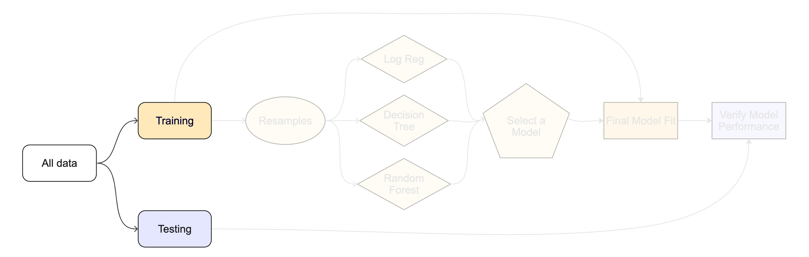

```{r setup}
#| include: false
#| file: setup.R
```

##  {background-image="https://media.giphy.com/media/Lr3UeH9tYu3qJtsSUg/giphy.gif" background-size="40%"}


## A classification data set

We've created an simulated data set (based on real data) that has

- Two numeric predictors (`pred_1` and `pred_2`)
- A factor column (`class`) with levels `"class_1"` and `"class_2"`

```{r}
#| label: class-example
library(tidymodels)
# cls_data_2026 is already loaded from the modeldata package
glimpse(cls_data_2026)
```


## Your turn {transition="slide-in"}

{.absolute top="0" right="0" width="150" height="150"}

Let's take 5 minutes and look at the data. 

```{r ex-class-data}
#| echo: false
countdown::countdown(minutes = 5, id = "data-eda")
```

## Checklist for predictors

- Is it ethical to use this variable? (Or even legal?)

- Will this variable be available at prediction time?

- Do we think that they are informative?

:::notes
- re: ethics -- do we use: exact geocodes, race/zipcode (or other proxies), etc
:::

## Data splitting and spending {.annotation}

For machine learning, we typically split data into training and test sets:

. . .

-   The **training set** is used to estimate model parameters.
-   The **test set** is used to find an independent assessment of model performance.

. . .

Do not 🚫 use the test set during training.

## Data splitting and spending

```{r test-train-split}
#| echo: false
#| fig.width: 12
#| fig.height: 3
#| 
set.seed(123)
library(forcats)
one_split <- tibble(x = 1:30) |> 
  initial_split() |> 
  tidy() |> 
  add_row(Row = 1:30, Data = "Original") |> 
  mutate(Data = case_when(
    Data == "Analysis" ~ "Training",
    Data == "Assessment" ~ "Testing",
    TRUE ~ Data
  )) |> 
  mutate(Data = factor(Data, levels = c("Original", "Training", "Testing")))
all_split <-
  ggplot(one_split, aes(x = Row, y = fct_rev(Data), fill = Data)) + 
  geom_tile(color = "white",
            linewidth = 1) + 
  scale_fill_manual(values = splits_pal, guide = "none") +
  theme_minimal() +
  theme(axis.text.y = element_text(size = rel(2)),
        axis.text.x = element_blank(),
        legend.position = "top",
        panel.grid = element_blank()) +
  coord_equal(ratio = 1) +
  labs(x = NULL, y = NULL)
all_split
```

# The more data<br>we spend 🤑<br><br>the better estimates<br>we'll get.

## Data splitting and spending

-   Spending too much data in **training** prevents us from computing a good assessment of predictive **performance**.

. . .

-   Spending too much data in **testing** prevents us from computing a good estimate of model **parameters**.

## Your turn {transition="slide-in"}

{.absolute top="0" right="0" width="150" height="150"}

*When is a good time to split your data?*

```{r ex-when-to-split}
#| echo: false
countdown::countdown(minutes = 3, id = "when-to-split")
```

# The testing data is precious 💎

## The initial split `r hexes("rsample")`

```{r cls-split}
set.seed(123)
cls_split <- initial_split(cls_data_2026)
cls_split
```

:::notes
How much data in training vs testing?
This function uses a good default, but this depends on your specific goal/data
:::

## What is `set.seed()`? {.annotation}

To create that split of the data, R generates "pseudo-random" numbers: while they are made to behave like random numbers, their generation is deterministic given a "seed".

This allows us to reproduce results by setting that seed.

Which seed you pick doesn't matter, as long as you don't try a bunch of seeds and pick the one that gives you the best performance.

## Accessing the data `r hexes("rsample")`

```{r cls-train-test}
cls_train <- training(cls_split)
cls_test <- testing(cls_split)
```

## The training set`r hexes("rsample")`

```{r cls-train}
cls_train
```

## The test set `r hexes("rsample")`

🙈

. . .

There are `r nrow(cls_test)` rows and `r ncol(cls_test)` columns in the test set.

## Your turn {transition="slide-in"}

{.absolute top="0" right="0" width="150" height="150"}

*Split your data so 20% is held out for the test set.*

*Try out different values in `set.seed()` to see how the results change.*

<br></br>

We recommend using the `.qmd` files in the `classwork/` folder for code exercises. They set you up with the code from the slides.

```{r ex-try-splitting}
#| echo: false
countdown::countdown(minutes = 5, id = "try-splitting")
```

## Data splitting and spending `r hexes("rsample")`

```{r cls-split-prop}
set.seed(123)
cls_split <- initial_split(cls_data_2026, prop = 0.8)
cls_train <- training(cls_split)
cls_test <- testing(cls_split)

nrow(cls_train)
nrow(cls_test)
```

## Your turn {transition="slide-in"}

*Explore the `cls_train` data on your own!*

* *What's the distribution of the outcome, `class`?*
* *What's the distribution of numeric variables?*

```{r ex-explore-train}
#| echo: false
countdown::countdown(minutes = 8, id = "explore-train")
```

::: notes
Make a plot or summary and then share with neighbor
:::

## The whole game - status update

```{r diagram-split, echo = FALSE}
#| fig-align: "center"


```
