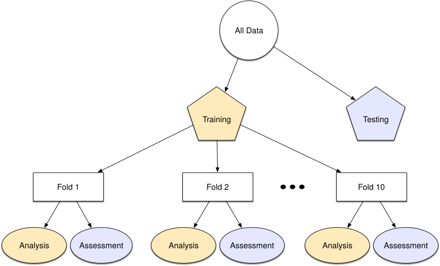

```{r setup}
#| include: false
#| file: setup.R
```

::: r-fit-text
Welcome!
:::

::: columns
::: {.column width="50%"}

<center>

### <i class="fa fa-wifi"></i>

Wi-Fi network name

`TODO-ADD-LATER`

</center>

:::

::: {.column width="50%"}

<center>

### <i class="fa fa-key"></i>

Wi-Fi password

`TODO-ADD-LATER`

</center>

:::
:::

## Who are you?

-   You can use the magrittr `%>%` or base R `|>` pipe

-   You are familiar with functions from dplyr, tidyr, ggplot2

-   You have exposure to basic statistical concepts

-   You do **not** need intermediate or expert familiarity with modeling or ML

-   You have used some tidymodels packages
 
-   You have some experience with evaluating statistical models using resampling techniques 

## Who are tidymodels?

-   Simon Couch
-   Hannah Frick
-   Emil Hvitfeldt
-   Max Kuhn

. . .

Many thanks to Davis Vaughan, Julia Silge, David Robinson, Julie Jung, Alison Hill, and Desirée De Leon for their role in creating these materials!

## `r emo::ji("eyes")` {.annotation}

{.absolute top="0" right="0"}

## `r emo::ji("eyes")`

{.absolute top="120" left="200" width="40%" }

::: footer
<span style="color:#CA225E;font-size:1.2rem;"><https://workshops.tidymodels.org></span>
:::

## Tentative plan for this workshop


- Model optimization by tuning
  - Grid search
  - Racing
- Postprocessing  
- Feature engineering with recipes
- Feature selection

##  {.center}

### Introduce yourself to your neighbors 👋

## Let's install some packages

If you are using your own laptop instead of Posit Cloud:

```{r load-pkgs}
#| eval: false

# Install the packages for the workshop
pkgs <- 
  c("bonsai", "C5.0", "Cubist", "doParallel", "earth", "embed", "finetune", 
    "lightgbm", "lme4", "pak", "parallelly", "plumber", "probably", 
    "ranger", "rpart", "rpart.plot", "rules", "splines2", "stacks", 
    "text2vec", "textrecipes", "tidymodels", "vetiver")

install.packages(pkgs)

pak::pak("simonpcouch/forested")
```

Also, you should install the newest version of the dials package (version 1.3.0). To check this, you can run: 

```{r}
#| label: check-dials
#| eval: false
#| echo: true
rlang::check_installed("dials", version = "1.3.0")
```

## MORE SLIDES HERE

## Load tidymodels `r hexes("tidymodels")`

```{r}
#| label: load-tm
library(tidymodels)
```


## Example data

One of the data sets that we'll use is a simulated classification example. The outcome has two classes and there are 25 numeric predictors. 

<br>

```{r}
#| label: load-class-data

"https://github.com/tidymodels/workshops/raw/refs/heads/2025-GMOFETML/slides/class_data.RData" |> 
  url() |> 
  load()

names(class_data)
```

## Your turn {transition="slide-in"}

Let's warm uo by taking 10 minutes to explore the data. 

<br>

We'll ask you to tell us something about these data that might be interesting for modeling. 

```{r ex-class-data}
#| echo: false
countdown::countdown(minutes = 10, id = "class-data")
```

# A quick review of tidymodels {background-color="#D04E59FF"}

## Data splitting `r hexes("rsample")`

One of our first tasks is to split our data into (at a minimum) a training set and a testing set. The rsample package has numerous functions for this, prefixed by `initial_`. 
<br>

Let's create a 3:1 split of the simulated data and use a stratfied random sample (by class):

```{r}
#| label: sim-split
#| code-line-numbers: "1|2-3|7-8|"
set.seed(429)
sim_split <- initial_split(class_data, prop = 0.75, strata = class)
sim_split

sim_train <- training(sim_split)
sim_test  <- testing(sim_split)
```

::: {.absolute bottom=0 right=0}
[AML4TD](https://aml4td.org/chapters/initial-data-splitting.html), [TMwR](https://www.tmwr.org/splitting)
:::

## Data splitting `r hexes(c("ggplot2", "rsample"))`

:::: {.columns}

::: {.column width="50%"}
```{r}
#| label: train-freq
#| fig-width: 6
#| fig-height: 4
sim_train |> 
  ggplot(aes(class)) + 
  geom_bar()
```
:::

::: {.column width="50%"}
```{r}
#| label: test-freq
#| fig-width: 6
#| fig-height: 4
sim_test |> 
  ggplot(aes(class)) + 
  geom_bar()
```
:::

::::

## Resampling 

:::: {.columns}

::: {.column width="45%"}
We'll want to get accurate estimates of model performance. 

Let's use a resampling method to make multiple versions of our data (using 10-fold cross-validation).

<br> 

For large amounts of data, a validation set is also a good alternative. 
:::

::: {.column width="55%"}

{fig-align='center' width=90%}
:::

::::

::: {.absolute bottom=0 right=0}
[AML4TD](https://aml4td.org/chapters/resampling.html), [TMwR](https://www.tmwr.org/resampling)
:::

## Resampling `r hexes("rsample")`

```{r}
#| label: sim-folds
set.seed(523)
sim_rs <- vfold_cv(sim_train, v = 10, strata = class)
sim_rs
```


## Resampled data sets `r hexes("rsample")`

```{r}
#| label: folds

model_data_1 <- analysis(sim_rs$splits[[1]])
model_data_1 |> count(class)

perf_data_1 <- assessment(sim_rs$splits[[1]])
perf_data_1 |> count(class)
```

## Models via parsnip `r hexes("parsnip")`

Let's fit a simple decision tree to the data: 

```{r}
#| label: sim-tree-fit
tree_fit <- 
  decision_tree(mode = "classification") |> 
  fit(class ~ ., data = model_data_1)
  
tree_fit
```  

## Predicting... `r hexes("parsnip")`


```{r}
#| label: sim-tree-pred
predict(tree_fit, new_data = head(perf_data_1, 4))

predict(tree_fit, new_data = head(perf_data_1, 4), type = "prob")
```  

## Augmenting... `r hexes(c("broom", "parsnip"))`

```{r}
#| label: sim-tree-aug
tree_pred <- augment(tree_fit, new_data = perf_data_1)
tree_pred
```  

## Performance metrics `r hexes("yardstick")`

There are _many_ yardstick metrics for [class predictions](https://yardstick.tidymodels.org/reference/index.html#classification-metrics) and [probability estimates](https://yardstick.tidymodels.org/reference/index.html#class-probability-metrics). 

Let's make a collection of metrics and then evaluate our model.

```{r}
#| label: sim-metrics
cls_metrics <- metric_set(brier_class, roc_auc, sensitivity, specificity)
tree_pred |> cls_metrics(truth = class, estimate = .pred_class, .pred_A)
```
::: {.absolute bottom=0 right=0}
[AML4TD](https://aml4td.org/chapters/cls-metrics.html)
:::

## Your turn {transition="slide-in"}

Fit a type different decision tree, this time:

- Using the C5.0 package
- Change the minimum number of samples required for splitting to 10. 

<br>

Did performance change much? 

<br>

```{r}
#| label: change-engine
#| echo: false
countdown::countdown(minutes = 5, id = "change-engine")
```


## Our versions

```{r pkg-list, echo = FALSE}
deps <- 
  c("bonsai", "Cubist", "doParallel", "earth", "embed", "finetune", 
    "lightgbm", "lme4", "parallelly", "plumber", "probably", "rules", "splines2", 
    "stacks", "text2vec", "textrecipes", "tidymodels", "vetiver")

loaded <- purrr::map(deps, ~ library(.x, character.only = TRUE))
excl <- c("iterators", "emo", "countdown", "stats", "graphics", 
          "grDevices", "utils", "datasets", "methods", "base", "forcats", 
          "infer", "foreach", "Matrix", "R6", "parallel", "devtools", "usethis")
loaded <- loaded[[length(loaded)]]
loaded <- loaded[!(loaded %in% excl)]
pkgs <- 
  sessioninfo::package_info(loaded, dependencies = FALSE) |> 
  select(-date)
df <- tibble::tibble(
  package = pkgs$package,
  version = pkgs$ondiskversion
)

ids <- split(
  seq_len(nrow(df)), 
  ceiling(seq_len(nrow(df)) / ceiling(nrow(df) / 4))
)

column1 <- df |>
  dplyr::slice(ids[[1]])

column2 <- df |>
  dplyr::slice(ids[[2]])

column3 <- df |>
  dplyr::slice(ids[[3]])

column4 <- df |>
  dplyr::slice(ids[[4]])

quarto_info <- paste0("Quarto (", system("quarto --version", intern = TRUE), ")")
```

`r R.version.string`, `r quarto_info`

::: {.columns style="font-size:0.7em;"}
::: {.column width="25%"}
```{r}
#| echo: false
knitr::kable(column1)
```
:::

::: {.column width="25%"}
```{r}
#| echo: false
knitr::kable(column2)
```
:::

::: {.column width="25%"}
```{r}
#| echo: false
knitr::kable(column3)
```
:::

::: {.column width="25%"}
```{r}
#| echo: false
knitr::kable(column4)
```
:::
:::

