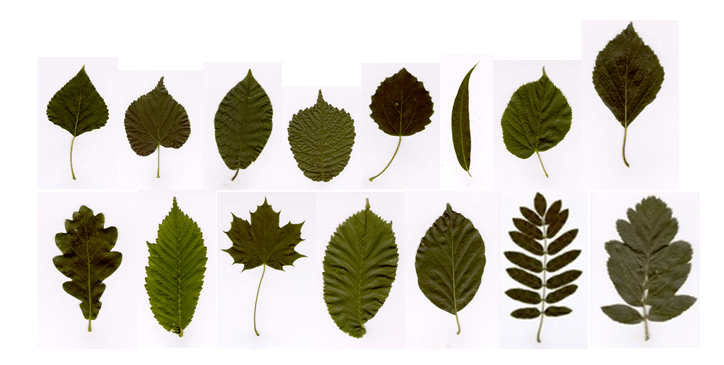
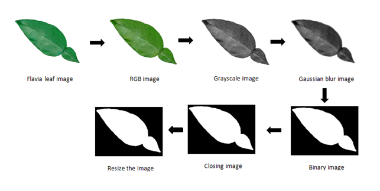
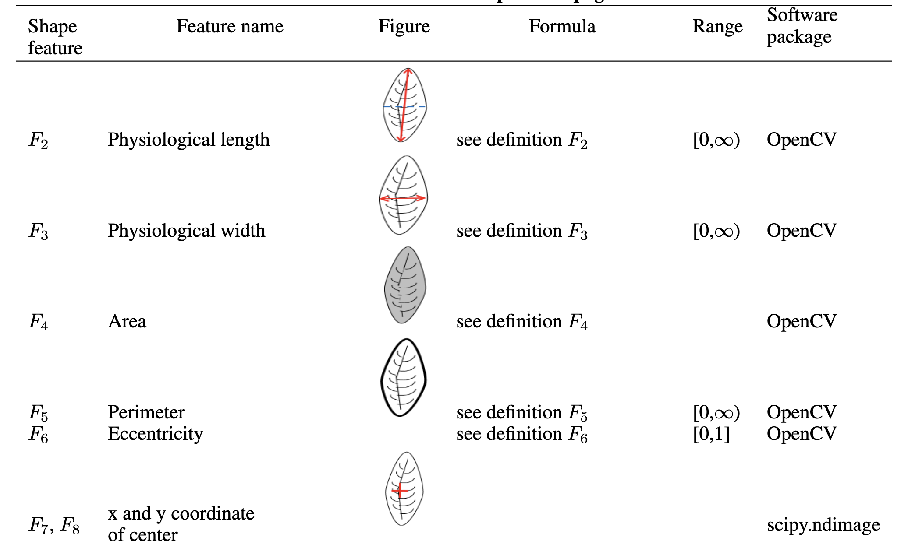

```{r setup}
#| include: false
#| file: setup.R
```

## Getting set up `r hexes("embed", "recipes")`

```{r}
#| label: user-startup

library(tidymodels)
library(embed)
library(extrasteps)

tidymodels_prefer()
theme_set(theme_bw())
options(pillar.advice = FALSE, pillar.min_title_chars = Inf)

# Load our example data for this section
"https://github.com/tidymodels/workshops/raw/refs/heads/2025-GMOFETML/slides/leaf_data.RData" |> 
  url() |> 
  load()
```

## Leaf data set

Slightly modified version of [modeldata::leaf_id_flavia](https://modeldata.tidymodels.org/reference/leaf_id_flavia.html).

```{r}
glimpse(leaf_data)
```

## Leaf data set

{fig-align="center"}

::: footer
Lakshika, J. P., & Talagala, T. S. (2021). Computer-aided interpretable features for leaf image classification. arXiv preprint arXiv:2106.08077.
:::

## Leaf data set

{fig-align="center"}

::: footer
Lakshika, J. P., & Talagala, T. S. (2021). Computer-aided interpretable features for leaf image classification. arXiv preprint arXiv:2106.08077.
:::

## Leaf data set

{fig-align="center"}

::: footer
Lakshika, J. P., & Talagala, T. S. (2021). Computer-aided interpretable features for leaf image classification. arXiv preprint arXiv:2106.08077.
:::

## Your turn

{.absolute top="0" right="0" width="150" height="150"}

*Load and explore the leaf data*

*Make time to look at `edge` column and think about how one would encode it into numerics*

```{r}
#| echo: false
countdown(minutes = 5, id = "explore-leaves")
```

## Leaf edges

::: {.columns}
::: {.column}

- Low number of unique levels
- Some overlap

:::
::: {.column}

```{r}
leaf_data |>
  count(edge)
```

:::
:::

## Leaf edges dummies

(techincally one-hot encoding)

```{r}
#| echo: false
recipe(~edge, data = leaf_data) |>
  step_dummy(edge, one_hot = TRUE) |>
  prep() |>
  bake(new_data = NULL) |>
  slice(100, 200, 300, 400, 500, 600) |>
  rename_with(\(x) stringr::str_remove(x, "edge_")) |>
  knitr::kable()
```

## Dummy variables

::: {.columns}
::: {.column}

### Pros

- Commonly used
- Easy interpretation
- Will rarely lead to a decrease in performance

:::
::: {.column}

### Cons

- Can create many columns
- Needs clean levels
- Not likely the most efficient representation

:::
:::

## Overlapping

::: {.columns}
::: {.column}

Some of the labels

- `lobed`
- `smooth`
- `toothed`
- `lobed, smooth`
- `lobed, toothed`

:::
::: {.column}

If you want to find a "toothed" leaf, which level do you pick?

- `toothed`
- `lobed, toothed`
- `toothed` and `lobed, toothed`


::: fragment
We can let `lobed, toothed` be counted for `lobed` and `toothed`
:::

:::
:::

# Advanced Dummies

## Advanced Dummies

This is basically a poor man's Natural Language Processing.

<br>

::: {style="text-align:center;"}
`tokenization -> counting`
:::

<br>

We think it is a frequent enough case that it is considered its own method.

We have 2 variants: "extraction" and "multi choice"

## Advanced Dummies - Extraction

Works on a singular column, using a regular expression to extract the items we want to count.

Done using regular expressions, either by specifying `sep` to split the string by, or by using `pattern` to extract the items.

Allows for 0 to many items in each string.

Implemented as `step_dummy_extract()`.

## Advanced Dummies - Extraction

::: {.columns}
::: {.column width="35%"}

### Input

```{r}
#| echo: false
#| comment: ""
values <- leaf_data |>
  count(edge) |>
  pull(edge)
values <-  paste0("\"", values, "\"")
 
cat(values, sep = "\n")
```

<br>

Using 

`sep = ", "`

:::
::: {.column width="65%"}

### Result

```{r}
#| echo: false
leaf_data |>
  count(edge) |>
  select(-n) |>
  recipe() |>
  step_dummy_extract(edge, sep = ", ") |>
  prep() |>
  bake(NULL) |>
  rename_with(\(x) stringr::str_remove(x, "edge_")) |>
  select(-other) |>
  knitr::kable()
```

:::
:::

## Advanced Dummies - Extraction

::: {.columns}
::: {.column width="50%"}

### Input

```{r}
#| echo: false
#| comment: ""
medium_examples <- tibble(
  medium = tate_text$medium[c(2, 5, 7, 9)]
)

medium_examples <- medium_examples |>
  tibble::add_row(medium = "Oil paint, ink on canvas")

values <- medium_examples |>
  pull(medium)
values <-  paste0("\"", values, "\"")
 
cat(values, sep = "\n")
```

<br>

Using

`sep = ", "`

:::
::: {.column width="50%"}

### Result

```{r}
#| echo: false
medium_examples |>
  recipe() |>
  step_dummy_extract(medium, sep = ", ") |>
  prep() |>
  bake(NULL) |>
  rename_with(\(x) stringr::str_remove(x, "medium_")) |>
  select(-other) |>
  knitr::kable()
```

:::
:::

## Advanced Dummies - Extraction

::: {.columns}
::: {.column width="50%"}

### Input

```{r}
#| echo: false
#| comment: ""
medium_examples <- tibble(
  medium = tate_text$medium[c(2, 5, 7, 9)]
)

medium_examples <- medium_examples |>
  tibble::add_row(medium = "Oil paint, ink on canvas")

values <- medium_examples |>
  pull(medium)
values <-  paste0("\"", values, "\"")
 
cat(values, sep = "\n")
```

<br>

Using

`sep = "(, )|( and )|( on )"`

:::
::: {.column width="50%"}

### Result

```{r}
#| echo: false
medium_examples |>
  recipe() |>
  step_dummy_extract(medium, sep = "(, )|( and )|( on )") |>
  prep() |>
  bake(NULL) |>
  rename_with(\(x) stringr::str_remove(x, "medium_")) |>
  select(-other) |>
  knitr::kable()
```

:::
:::

## Advanced Dummies - Extraction

::: {.columns}
::: {.column width="50%"}

### Input

```{r}
#| echo: false
#| comment: ""
color_examples <- tibble(
  colors = c(
    "['red', 'blue']",
    "['red', 'blue', 'white']",
    "['blue', 'blue', 'blue']"
  )
)
values <- color_examples |>
  pull(colors)
values <-  paste0("\"", values, "\"")
 
cat(values, sep = "\n")
```

<br>

Using

`pattern = "(?<=')[^',]+(?=')"`

:::
::: {.column width="50%"}

### Result

```{r}
#| echo: false
color_examples |>
  recipe() |>
  step_dummy_extract(colors, pattern = "(?<=')[^',]+(?=')") |>
  prep() |>
  bake(NULL) |>
  rename_with(\(x) stringr::str_remove(x, "colors_")) |>
  select(-other) |>
  knitr::kable()
```

:::
:::

## Advanced Dummies - Multi Choice

Works on multiple columns, counting items across columns.

Can be seen as joining multiple applications of dummy variables together.

Allows for 0 to many items.

Implemented as `step_dummy_multi_choice()`.

## Advanced Dummies - Multi Choice

::: {.columns}
::: {.column width="45%"}

### Input

```{r}
#| echo: false
#| comment: ""
values <- tribble(
  ~lang_1,    ~lang_2,   ~lang_3,
  "English",  "Italian", "French",
  "Spanish",  "French",  NA,
  "English",  NA,        NA,
  NA,         NA,        NA
)
knitr::kable(values)
```

:::

::: {.column width="55%"}

### Result

```{r}
#| echo: false
recipe(~., data = values) |>
  step_dummy_multi_choice(starts_with("lang")) |>
  prep() |>
  bake(NULL) |>
  rename_with(\(x) stringr::str_remove(x, "lang_1_")) |>
  knitr::kable()
```

:::
:::

## Othering

Both `step_dummy_extract()` and `step_dummy_multi_choice()` contain a `threshold` argument.

This is used to combine infrequent levels together.

We have a step `step_other()` that does this for nominal variables, but it doesn't work in these cases as it has to happen after the extraction/combination.

## Othering

`threshold = 0` produces 1217 columns

```{r}
#| echo: false
recipe(~ medium, data = tate_text) |>
  step_dummy_extract(medium, sep = "(, )|( and )|( on )", threshold = 0) |>
  prep() |>
  bake(NULL) |>
  rename_with(\(x) stringr::str_remove(x, "medium_")) |>
  slice(1:6) |>
  knitr::kable()
```

## Othering

`threshold = 0.05` produces 11 columns

```{r}
#| echo: false
recipe(~ medium, data = tate_text) |>
  step_dummy_extract(medium, sep = "(, )|( and )|( on )", threshold = 0.05) |>
  prep() |>
  bake(NULL) |>
  rename_with(\(x) stringr::str_remove(x, "medium_")) |>
  slice(1:6) |>
  knitr::kable()
```

## Your turn

{.absolute top="0" right="0" width="150" height="150"}

*Figure out whether `step_dummy_extract()` or `step_dummy_multi_choice()` is most appropriate on `edge` variable in `leaf_data` and apply it*

```{r}
#| echo: false
countdown(minutes = 3, id = "dummy-leaves")
```

# Dimensionality Reduction

## Dimensionality Reduction

### What is it?

Techniques that remove or alter features in order to have fewer but more informative features.

### Why do we do it?

- redundant information
- ineffective representation
- computational speed

## Redundant Information

A feature with no information could be included

```{r}
leaf_data |>
  count(outlying_contour)
```

## Redundant Information

Or duplicated or functionally equivalent features

```{r}
leaf_data |>
  ggplot(aes(area, equivalent_diameter)) +
  geom_point()
```

## Ineffective Representation

While keeping our models in mind, we want to make sure the data is well-suited

- Correlated data
  - hard for some models
- lat/lon compared to distance/angle
  - hard for most models

## Ineffective Representation

```{r}
#| echo: false
leaf_data |>
  ggplot(aes(mean_red_val, mean_blue_val)) +
  geom_point()
```

## Ineffective Representation

```{r}
#| echo: false
leaf_data |>
  ggplot(aes(physiological_length, diameter)) +
  geom_point()
```

## Computational Speed

Depending on what method we are using and how the data is affected by it, we could see a large reduction in features. Which in turn leads to a smaller model that is faster to train on.

Only exploration and trial and error can determine whether you should use dimensionality reduction techniques. Knowing which methods do what helps you determine what to try.

## Dimensionality Reduction Method

- Zero Variance removal
- PCA
  - Truncated PCA
  - Sparse PCA
- NNMF
- UMAP
- Isomap

## Restrictions

All the methods shown today will not be able to handle

- missing data
- Non-numeric data

## Why not t-SNE?

One of the main requirements for a feature engineering method is that you can reapply the trained transformation done on the training data set, to the testing data set.

This is not possible with t-SNE as it is an iterative method that shifts observations in the lower-dimensional space based on their distances to points in the higher-dimensional space.

It doesn't create a mapping that can be reused.

## PCA

**P**rincipal **C**ompoment **A**nalysis is a linear combination of the original data such that most of the variation is captured in the first variable, then second, then third, and so one.

## PCA Algorithm

The first principal component of a set of features $X_1, X_2, ..., X_p$ is the normalized linear combination of the features.

$$
Z_1 = \phi_{11} X_1 + \phi_{21} X_2 + ... + \phi_{p1}X_p
$$

that has the largest variance under the constraint that $\sum_{j=1}^p  \phi_{j1}^2 = 1$.

we refer to $\phi_{11}, ..., \phi_{p1}$ as the loadings of the first principal component.

And think of them as the loading vector $\phi_1$.

## PCA Algorithm 

since we have $z_{i1} = \phi_{11} x_{i1} + \phi_{21} x_{i2} + ... + \phi_{p1}x_{ip}$, then we can write

$$
\underset{\phi_{11}, ..., \phi_{p1}}{\text{maximize}} \left\{ \dfrac{1}{n} \sum^n_{i=j} z_{i1} ^2 \right\} \quad \text{subject to} \quad \sum_{j=1}^p  \phi_{j1}^2 = 1
$$

We are in essence maximizing the sample variance of the $n$ values of $z_{i1}$.

We refer to $z_{11}, ..., z_{n1}$ as the scores of the first principal component.

## PCA Algorithm

Luckily this can be solved using techniques from Linear Algebra more specifically, it can be solved using an eigen decomposition.

One of the main strengths of PCA is that you don't need to use optimization to get the results without approximations.

## PCA Algorithm

Once the first principal component is calculated, we can calculate the second principal component 

We find the second principal component $Z_2$ as a linear combination of $X_1, ..., X_p$ that has the maximal variance out of the linear combinations that are uncorrelated with $Z_1$

this is the same as saying that $\phi_2$ should be orthogonal to the direction $\phi_1$

## How is that a dimensionality reduction method?

By itself it itsn't as it rotates all the features in the feature space.

It becomes a dimensionality reduction method if we only calculate some of the principal components.

This is typically done by retaining a specific number of components or as a threshold on the variance explained.

## 4 different percent variance plots

```{r}
#| label: pca-cumulative-percent-variance
#| echo: false
#| fig-alt: |
#|   Faceted bar chart chart. 4 bar charts in a 2 by 2 grid. Each one represents
#|   a different data set which has had PCA applied to it. 
set.seed(1234)

data_cumpervar <- function(data) {
data |>
  select(where(is.numeric)) |>
  recipe(~.) |>
  step_normalize(all_predictors()) |>
  step_pca(all_predictors()) |>
  prep() |> 
  tidy(2, type = "variance") |>
  filter(terms == "percent variance")
}
library(scales)

bind_rows(
data_cumpervar(mtcars),
data_cumpervar(ames),
data_cumpervar(Chicago),
data_cumpervar(concrete)
) |>
  ggplot(aes(component, value)) +
  geom_col() +
  facet_wrap(~id, scales = "free_x") +
  labs(
    y = "Percent variance"
  ) +
  theme_minimal() +
  scale_x_continuous(breaks = c(5, seq(0, 100, by = 10)))
```

## Applying PCA with recipes  `r hexes("recipes")`

Either using `num_comp` argument

```{r}
rec <- recipe(mpg ~ ., data = mtcars) |>
  step_pca(all_numeric_predictors(), num_comp = 5)
```

<br>

or using `threshold` argument

```{r}
rec <- recipe(mpg ~ ., data = mtcars) |>
  step_pca(all_numeric_predictors(), threshold = 0.8)
```

## Your turn

{.absolute top="0" right="0" width="150" height="150"}

*Apply PCA using `step_pca()` to `leaf_data` data set.*

*Experiment with different values of `num_comp` and or `threshold`.*

```{r}
#| echo: false
countdown(minutes = 5, id = "pca-leaf_data")
```

## PCA Pros and Cons

::: {.columns}
::: {.column}

### Pros

- Fast
- Reliable
- Exact results (up to sign changes)

:::
::: {.column}

### Cons

- Computational time is linear in the number of columns
- Can be quite hard to interpret

:::
:::

## Truncated PCA

> Computational time is linear in the number of columns

By default `step_pca()` calculates all the loading vectors. And then subsets them down to what you need.

Instead we can use a different implementation that only calculates what you need. This is what we call truncated PCA.

## Truncated PCA with recipes `r hexes("embed", "recipes")`

Can only be done using `num_comp`

```{r}
library(embed)

rec <- recipe(mpg ~ ., data = mtcars) |>
  step_pca_truncated(all_numeric_predictors(), num_comp = 5)
```

## Sparse PCA

> Can be quite hard to interpret

Every component is a linear combination of **all predictors**.

$$
\begin{alignat}{4}
PC1 &= cyl \cdot -0.021 &&+ disp \cdot -0.85 &&+ hp \cdot -0.52 &&+ drat \cdot -0.01\\
 PC2 &= cyl \cdot 0.013 &&+ disp \cdot -0.52 &&+ hp \cdot 0.85 &&+ drat \cdot 0.02\\
PC3 &= cyl \cdot -0.12 &&+ disp \cdot 0.016 &&+ hp \cdot 0.081 &&+ drat \cdot -0.19\\
PC4 &= cyl \cdot -0.22 &&+ disp \cdot -0.0061 &&+ hp \cdot 0.033 &&+ drat \cdot -0.14\\
PC5 &= cyl \cdot 0.73 &&+ disp \cdot -0.014 &&+ hp \cdot 0.0016 &&+ drat \cdot -0.33
\end{alignat}
$$

If we could force some of the loadings to be 0 it would reduce things a lot.

## Sparse PCA with recipes `r hexes("embed", "recipes")`

Can only be done using `num_comp`.

`predictor_prop` argument is used to determine how many zeroes in the loadings.

```{r}
library(embed)

rec <- recipe(mpg ~ ., data = mtcars) |>
  step_pca_sparse(all_numeric_predictors(), num_comp = 5, predictor_prop = 0.8)
```

## Sparse PCA with recipes `r hexes("embed", "recipes")`

`predictor_prop = 0.8`

```{r}
recipe(mpg ~ ., data = mtcars) |>
  step_pca_sparse(all_numeric_predictors(), num_comp = 4, predictor_prop = 0.8) |>
  prep() |>
  tidy(1) |>
  pivot_wider(names_from = component, values_from = value) |>
  select(-id)
```

## Sparse PCA with recipes `r hexes("embed", "recipes")`

`predictor_prop = 0.2`

```{r}
recipe(mpg ~ ., data = mtcars) |>
  step_pca_sparse(all_numeric_predictors(), num_comp = 4, predictor_prop = 0.2) |>
  prep() |>
  tidy(1) |>
  pivot_wider(names_from = component, values_from = value) |>
  select(-id)
```

## NNMF

**N**on-**N**egative **M**atrix **F**actorization is conceptually similar to PCA, but it has different objectives. 

PCA aims to generate uncorrelated components that maximize the variances. One component at a time.

NNMF on the other hand jointly optimizes all the components under the the constraint that all the loadings are non-negative. While the data is also non-negative.

## NNMF restriction

The data has to be non-negative, i.e., 0 or higher.

This might feel like a pretty big restriction. And that is not wrong. But a lot of data sets end up being naturally non-negative.

Or could at least be turned into non-negative ones with transformations.

It makes for much easier interpretations as the loadings don't cancel each other out like they do for PCA.

## NNMF Pros and Cons

::: {.columns}
::: {.column}

- More interpretable results
- Pulls out better structures

:::
::: {.column}

- Data must be non-negative
- Computationally expensive
- Training depends on the seed

:::
:::

## NNMF with recipes `r hexes("embed", "recipes")`

`predictor_prop = 0.2`

```{r}
set.seed(1234)

recipe(mpg ~ ., data = mtcars) |>
  step_nnmf_sparse(all_numeric_predictors(), num_comp = 2) |>
  prep() |>
  tidy(1) |>
  pivot_wider(names_from = component, values_from = value) |>
  select(-id)
```

## UMAP

**U**niform **M**anifold **A**pproximation and **P**rojection is another method that takes high dimensional data and transform it into a lower dimensional space.

Runs relatively fast and is  popular in visualizations.

## UMAP Algorithm

Rough algorithm

1. Use spectral embedding to embed points in low dimensional space
2. Calculate similarity scores between points based on original data set
3. Randomly samples pair of points based on their similarity scores
4. Flips a coin to decide which of the pair of points to the other one
5. Randomly picks a non-neighbor point to move away from
6. Moves the selected point towards its neighbor and away from its non-neighbor
7. Repeat 3-6

## UMAP parameters

- `n_neighbors`

Determines how many points are considered neighbors. A point counts as its own neighbor.
Lower values lead to local view.

- `min_dist`

Determines how close points are allowed to be to each other in the low dimentional space.

- `metric`

How distances are calculated in the input data. `euclidean`, `manhattan`, `jaccard` etc etc

## UMAP hesitancy 

Due to the flexibility of how this method work, it is almost always possible to generate graphs that appear to have insights in them.

## Which was created with random data?

```{r}
#| echo: false
set.seed(2)
data_random <- rnorm(1000 * 100) |>
  matrix(ncol = 1000) |>
  as_tibble()

umap_2 <- recipe(~., data_random) |>
  step_umap(all_predictors(), neighbors = 2) |>
  prep() |>
  bake(NULL)

umap_3 <- recipe(~., data_random) |>
  step_umap(all_predictors(), neighbors = 3) |>
  prep() |>
  bake(NULL)

umap_5 <- recipe(~., data_random) |>
  step_umap(all_predictors(), neighbors = 5) |>
  prep() |>
  bake(NULL)

umap_10 <- recipe(~., data_random) |>
  step_umap(all_predictors(), neighbors = 10) |>
  prep() |>
  bake(NULL)
  
umap_all <- bind_rows(
  umap_2 |> mutate(type = "A", neighbors = 2),
  umap_3 |> mutate(type = "B", neighbors = 3),
  umap_5 |> mutate(type = "C", neighbors = 5),
  umap_10 |> mutate(type = "D", neighbors = 10)
)

umap_all |>
  ggplot(aes(UMAP1, UMAP2)) +
  geom_point() +
  facet_wrap(~type, scales = "free")
```

## All of them! Different `n_neighbors`

```{r}
#| echo: false
umap_all |>
  ggplot(aes(UMAP1, UMAP2)) +
  geom_point() +
  facet_wrap(~neighbors, scales = "free")
```

## umap with recipes `r hexes("embed", "recipes")`

`predictor_prop = 0.2`

```{r}
library(embed)
set.seed(1234)

recipe(mpg ~ ., data = mtcars) |>
  step_umap(all_numeric_predictors()) |>
  prep() |>
  bake(NULL)
```

## Isomap

Isometric mapping is a non-linear dimensionality reduction method. 

This is another method that uses distances between points to produce graphs of neighboring points. Where this method is different than other methods is that is uses geodesic distances as opposed straight-line distances.

The geodesic distance is the sum of edge weights along the shortest path between two points.

The eigenvectors of the deodesic distance metric is then used to represent the new coordinates.

## Isomap Algorithm

A very high-level description of Isomap algorithm is given below.

1. Find the neighbors for each point
2. Construct the neighborhood graph, using euclidean distance as edge length
3. Calculate shorted path between each pair of points
4. Use Multidimensional scaling to compute lower dimensional embedding

## Isomap Pros and Cons

::: {.columns}
::: {.column}

### Pros

- Captures non-linear effects
- Caputres long-range structure not just local structure
- No parameters to set other than neighbors

:::
::: {.column}

### Cons

- Computationally expensive
- Assumes a single connected manifold

:::
:::

## isomap with recipes `r hexes("recipes")`

```{r}
library(embed)
set.seed(1234)

recipe(mpg ~ ., data = mtcars) |>
  step_isomap(all_numeric_predictors(), neighbors = 10) |>
  prep() |>
  bake(NULL)
```

## Hotel rates data set

Regression data set for predicting the average daily rate for a room, for "Resort Hotel". The `agent` and `company` use random names.

```{r}
glimpse(hotel_rates)
```

::: footer
Antonio, N., de Almeida, A., and Nunes, L. (2019). Hotel booking demand datasets. Data in Brief, 22, 41-49.
:::

## Hotel data splitting

Genrally you should always do data splitting. We are doing it here explicitly because some artifacts of splitting data becomes useful later on.

```{r}
set.seed(1234)
hotel_split <- initial_split(hotel_rates)
hotel_train <- training(hotel_split)
hotel_test <- testing(hotel_split)
```

## Your turn

{.absolute top="0" right="0" width="150" height="150"}

*Load and explore the hotel_train data*

*Comes loaded with the modeldata package*

```{r}
#| echo: false
countdown(minutes = 5, id = "explore-hotels")
```

## Splines

TODO

A way to handle nonlinear effects,
I think arrival_date_num, lead_time, stays_in_week_nights, stays_in_weekend_nights would be good candidates

Explanation of what a spline is and how it works

Visualization of one in use

Showing how there are different kinds of splines

periodic splines

benefits
- fast
- easy to use
- semi-interpretable

## Factors with many categories

::: {.columns}
::: {.column width=30%}

```{r}
hotel_train |>
  count(country)
```

:::
::: {.column width=35%}

```{r}
hotel_train |>
  count(company)
```

:::
::: {.column width=35%}

```{r}
hotel_train |>
  count(agent)
```

:::
:::

## How do we handle them?

. . .

We could:

-   Make the full set of indicator variables 😳

-   Lump agents and companies that rarely occur into an "other" group

-   Use [feature hashing](https://www.tmwr.org/categorical.html#feature-hashing) to create a smaller set of indicator variables

-   Use target encoding to replace the `county`, `agent`, and `company` columns with the estimated effect of that predictor

## Target encoding

**Target encoding** (also called **mean encoding**, **likelihood encoding**, **impact encoding**, or **effect encoding**) is a supervised trained method that turn a single categorical predictor into a single numeric predictor.

It is often used to deal with categorical predictors with many levels, altough it works regardless.

Since it uses the outcome to train it, you need to make sure to use cross validation to avoid overfitting.

## Target encoding motivation

You have a numeric outcome, and a categorical predictor. And you want to transform each value of the categorical predictor into a value that best represents the outcome?

. . .

::: {.columns}
::: {.column}

We calculate the mean of the outcome within each level of the predictor, and use that as the new value.

:::
::: {.column}

```{r}
hotel_train |>
  summarise(
    mean = mean(avg_price_per_room),
    .by = agent
  )
```

:::
:::

## Target encoding handling unseen levels

::: {.callout-caution}
Don't look at testing data set. This is done for education purposes.
:::

::: {.columns}
::: {.column}

```{r}
hotel_train |>
  count(agent, .drop = FALSE)
```

:::
::: {.column}

```{r}
hotel_test |>
  count(agent, .drop = FALSE)
```

:::
:::

## Target encoding handling unseen levels

::: {.columns}
::: {.column}

Calculate the global mean of the outcome and use it for cases that aren't seen in the training data set.

<br>

```{r}
mean(hotel_train$avg_price_per_room)
```

:::
::: {.column}

```{r}
hotel_train |>
  summarise(
    mean = mean(avg_price_per_room),
    .by = agent
  )
```

:::
:::

## How do we handle low counts?

::: {.columns}
::: {.column}

Some of the levels have very low counts. we can't have the same confidence in those means than the means calcuated on high counts.

We use the global mean to account for 0 occurances. Let us adjust the calculated mean by the global mean depending on the counts.

:::
::: {.column}

```{r}
hotel_train |>
  summarise(
    mean = mean(avg_price_per_room),
    n = n(),
    .by = agent
  ) |>
  arrange(agent)
```

:::
:::

## Partial pooling

Partial pooling somewhat lowers the risk of overfitting since it tends to correct for agents with small sample sizes. It can’t correct for improper data usage or data leakage though. 

## Partial pooling results

```{r}
#| warning: false
#| echo: false
rec_no_smooth <- recipe(avg_price_per_room ~ agent, data = hotel_train) |>
  step_lencode(agent, outcome = vars(avg_price_per_room), smooth = FALSE, id = "no_smooth") |>
  prep() |>
  tidy(1)

rec_smooth <- recipe(avg_price_per_room ~ agent, data = hotel_train) |>
  step_lencode(agent, outcome = vars(avg_price_per_room), smooth = TRUE, id = "smooth") |>
  prep() |>
  tidy(1)

bind_rows(
  rec_no_smooth,
  rec_smooth
) |>
  pivot_wider(values_from = value, names_from = id) |>
  left_join(
    count(hotel_train, agent), by = c("level" = "agent")
  ) |>
  ggplot(aes(no_smooth, smooth, size = n)) +
  geom_abline(slope = 1, intercept = 0, color = "red") +
  geom_abline(slope = 0, intercept = mean(hotel_train$avg_price_per_room), color = "blue") +
  geom_point(alpha = 0.5) +
  labs(
    x = "mean",
    y = "partial pooled mean"
  )
```

## Implentations

We have described this method solely based on analytical calculations (`step_lencode()`) but you could arrive at similar numbers using a model based approach by fitting a no-intercept generalized linear model. An hierarchical version would induce the partial pooling.

- `step_lencode_glm()`
- `step_lencode_bayes()`
- `step_lencode_mixed()`

## Target encoding in recipes `r hexes("embed", "recipes")`

```{r}
recipe(avg_price_per_room ~ ., data = hotel_train) |>
  step_lencode(
    agent, country, company, 
    outcome = vars("avg_price_per_room"),
    smooth = TRUE,
  ) |>
  prep() |>
  bake(NULL) |>
  select(agent, country, company)
```

## Your turn

{.absolute top="0" right="0" width="150" height="150"}

*Apply target encoding to the data set, see how it affects different predictors, not just the ones we listed here.*

- `step_lencode()`
- `step_lencode_glm()`
- `step_lencode_bayes()`
- `step_lencode_mixed()`

```{r}
#| echo: false
countdown(minutes = 3, id = "explore-lencode")
```

## Date time variables

How can we represent the date column `arrival_date` for our model?

. . .

When we use a date column in its native format, most models in R convert it to an integer.

. . .

We can re-engineer it as:

-   Days since a reference date
-   Day of the week
-   Month
-   Year
-   Indicators for holidays

::: notes
The main point is that we try to maximize performance with different versions of the predictors. 

Mention that, for the Chicago data, the day or the week features are usually the most important ones in the model.
:::

## Your turn

{.absolute top="0" right="0" width="150" height="150"}

*Explore the `arrival_date` variable and its relation to `avg_price_per_room`*

*The lubridate package might provide helpful*

```{r}
#| echo: false
countdown(minutes = 5, id = "explore-arrival_date")
```

## `arrival_date` date features

using `step_date( features = c("year", "month", "dow", "decimal", "mday", "doy", "week", "semester", "quarter"))`

```{r}
#| echo: false
recipe(~ arrival_date, data = hotel_rates) |>
  step_date(arrival_date, features = c(
        "year",
        "month",
        "dow",
        "decimal",
        "mday",
        "doy",
        "week",
        "semester",
        "quarter"
      )) |>
  prep() |>
  bake(NULL) |>
  slice(c(2000, 4000, 6000, 8000, 10000)) |>
  rename_with(\(x) stringr::str_remove(x, "arrival_date_")) |>
  knitr::kable()
```

## `arrival_date` date features

Adding `label = FALSE`

```{r}
#| echo: false
recipe(~ arrival_date, data = hotel_rates) |>
  step_date(arrival_date, label = FALSE,
  features = c(
        "year",
        "month",
        "dow",
        "decimal",
        "mday",
        "doy",
        "week",
        "semester",
        "quarter"
      )) |>
  prep() |>
  bake(NULL) |>
  slice(c(2000, 4000, 6000, 8000, 10000)) |>
  rename_with(\(x) stringr::str_remove(x, "arrival_date_")) |>
  knitr::kable()
```

## Other recipes steps

- `step_time()`

Works the same as `step_date()` but for smaller than day measurements: hour, hour12, am/pm, minute, second, decimal_day.

- `step_holiday()`

Adds indicators for holidays. See `timeDate::listHolidays()` for supported holidays.

## Your turn

{.absolute top="0" right="0" width="150" height="150"}

*Apply date steps to the `arrival_date` variable and try to see if we capture anything about `avg_price_per_room`*

```{r}
#| echo: false
countdown(minutes = 3, id = "step_date-step_holiday-arrival_date")
```

## dates as numerics

```{r}
#| echo: false
recipe(~ arrival_date, data = hotel_rates) |>
  step_date(arrival_date, label = FALSE,
  features = c(
        "year",
        "month",
        "dow",
        "decimal",
        "mday",
        "doy",
        "week",
        "semester",
        "quarter"
      )) |>
  prep() |>
  bake(NULL) |>
rename_with(\(x) stringr::str_remove(x, "arrival_date_")) |>
  select(arrival_date, month, dow, mday) |>
  distinct() |>
  pivot_longer(-arrival_date) |>
  ggplot(aes(arrival_date, value)) +
  geom_col() +
  facet_grid(name ~ ., scales = "free_y")
```

## holidays as numerics

```{r}
#| echo: false
recipe(~ arrival_date, data = hotel_rates) |>
  step_holiday(arrival_date) |>
  prep() |>
  bake(NULL) |>
rename_with(\(x) stringr::str_remove(x, "arrival_date_")) |>
  distinct() |>
  pivot_longer(-arrival_date) |>
  ggplot(aes(arrival_date, value)) +
  geom_col() +
  facet_grid(name ~ ., scales = "free_y")
```

## What are the issues with these features?

The numeric features makes it easy to capture the end or beginning, but harder anything more granular.

The indicators mostly care about the day itself. No information about the lead up or aftermath

## time events

Using `extrasteps::step_time_event()` and the [almanac](https://davisvaughan.github.io/almanac/index.html) package, we can create useful time features.

```{r}
library(almanac)

rule_1 <- weekly() |>
  recur_on_weekdays() |>
  rsetdiff(hol_christmas())

rule_2 <- monthly(since = "2000-01-01") %>%
  recur_on_interval(3) %>%
  recur_on_day_of_month(1)

rule_3 <- yearly("1997-06-05") %>%
  recur_on_day_of_week("Thursday") %>%
  recur_on_month_of_year(c("Jun", "July", "Aug"))
```

## `step_time_event()`

Create a list of rules (last slide) and pass them to `rules` argument of `step_time_event()`

```{r}
#| eval: false
rules <- list(rule_1 = rule_1, rule_2 = rule_2, rule_3 = rule_3)

recipe(~ arrival_date, data = hotel_rates) |>
  step_time_event(arrival_date, rules = rules)
```

## `step_time_event()` as numerics

```{r}
#| echo: false
rules <- list(rule_1 = rule_1, rule_2 = rule_2, rule_3 = rule_3)

recipe(~ arrival_date, data = hotel_rates) |>
  step_time_event(arrival_date, rules = rules, keep_original_cols = TRUE) |>
  prep() |>
  bake(NULL) |>
  rename_with(\(x) stringr::str_remove(x, "arrival_date_")) |>
  distinct() |>
  pivot_longer(-arrival_date) |>
  ggplot(aes(arrival_date, value)) +
  geom_col() +
  facet_grid(name ~ ., scales = "free_y")
```

## Non-indicator time events

These features still have the issue is that they only attach value to the date themselves.

We can attach values based on how far we are away from those dates

- `step_date_before()`
- `step_date_after()`
- `step_date_nearest()`

## `step_date_before()`

```{r}
#| echo: false
rules <- list(rule_1 = rule_1, rule_2 = rule_2, rule_3 = rule_3)

recipe(~ arrival_date, data = hotel_rates) |>
  step_mutate(arrival_date0 = arrival_date) |>
  step_date_before(arrival_date0, rules = rules) |>
  prep() |>
  bake(NULL) |>
  rename_with(\(x) stringr::str_remove(x, "arrival_date0_")) |>
  distinct() |>
  pivot_longer(-arrival_date) |>
  ggplot(aes(arrival_date, value)) +
  geom_col() +
  facet_grid(name ~ ., scales = "free_y")
```

## `step_date_before()` - inverse

```{r}
#| echo: false
rules <- list(rule_1 = rule_1, rule_2 = rule_2, rule_3 = rule_3)

recipe(~ arrival_date, data = hotel_rates) |>
  step_mutate(arrival_date0 = arrival_date) |>
  step_date_before(arrival_date0, rules = rules, transform = "inverse") |>
  prep() |>
  bake(NULL) |>
  rename_with(\(x) stringr::str_remove(x, "arrival_date0_")) |>
  distinct() |>
  pivot_longer(-arrival_date) |>
  ggplot(aes(arrival_date, value)) +
  geom_col() +
  facet_grid(name ~ ., scales = "free_y")
```

## `step_date_after()` - inverse

```{r}
#| echo: false
rules <- list(rule_1 = rule_1, rule_2 = rule_2, rule_3 = rule_3)

recipe(~ arrival_date, data = hotel_rates) |>
  step_mutate(arrival_date0 = arrival_date) |>
  step_date_after(arrival_date0, rules = rules, transform = "inverse") |>
  prep() |>
  bake(NULL) |>
  rename_with(\(x) stringr::str_remove(x, "arrival_date0_")) |>
  distinct() |>
  pivot_longer(-arrival_date) |>
  ggplot(aes(arrival_date, value)) +
  geom_col() +
  facet_grid(name ~ ., scales = "free_y")
```

## `step_date_nearest()` - inverse

```{r}
#| echo: false
rules <- list(rule_1 = rule_1, rule_2 = rule_2, rule_3 = rule_3)

recipe(~ arrival_date, data = hotel_rates) |>
  step_mutate(arrival_date0 = arrival_date) |>
  step_date_nearest(arrival_date0, rules = rules, transform = "inverse") |>
  prep() |>
  bake(NULL) |>
  rename_with(\(x) stringr::str_remove(x, "arrival_date0_")) |>
  distinct() |>
  pivot_longer(-arrival_date) |>
  ggplot(aes(arrival_date, value)) +
  geom_col() +
  facet_grid(name ~ ., scales = "free_y")
```

## Datetime features

Avoid crafting datetime features by hand if at all possible.

Dealing with uneven month lengths, leap days (leap seconds)

Or tried to define any event that doesn't land on the same day of the week or date each year

> The first Sunday after the first full moon on or after the vernal equinox
