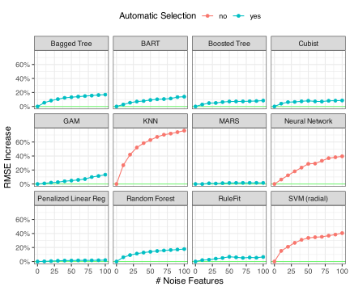

```{r setup}
#| include: false
#| file: setup.R
```

```{r}
#| label: start-quiet
#| include: false
library(mirai)
daemons(0) # reset to sequential if re-running
daemons(parallel::detectCores())
```

## Startup!  `r hexes(c("tidymodels"))`

```{r}
#| label: user-startup
library(tidymodels)
library(important)
library(tailor)
library(probably)

tidymodels_prefer()
theme_set(theme_bw())
options(pillar.advice = FALSE, pillar.min_title_chars = Inf)
```

## More startup! 

```{r}
#| label: user-startup-2
# Load our example data for this section
"https://github.com/tidymodels/workshops/raw/refs/heads/2025-GMOFETML/slides/class_data.RData" |> 
  url() |> 
  load()

set.seed(429)
sim_split <- initial_split(class_data, prop = 0.75, strata = class)
sim_train <- training(sim_split)
sim_test  <- testing(sim_split)

set.seed(523)
sim_rs <- vfold_cv(sim_train, v = 10, strata = class)
```

```{r}
#| label: noise-truth
#| include: false
noise_ind <- c(1, 2, 4, 7, 8, 9, 11, 12, 13, 15, 16, 21, 24, 28, 30)
noise_cols <- recipes::names0(max(noise_ind), "predictor_")
noise_cols <- noise_cols[noise_ind]
num_noise <- length(noise_ind)
all_cols <- sim_train |> select(-class) |> names()
num_total <- length(all_cols)
num_real <- num_total - num_noise
```


# Why remove features/predictors?  {background-color="#E0D890FF"}

## Models and feature selection

Some models _automatically_ remove predictors by never using them in the model: 

 - tree- and rule-based models
 - some regularized models (e.g., `glmnet`)
 - multivariate adaptive regression splines
 - RuleFit
 - _not really_ ensembles though
 
Sometimes using irrelevant predictors *hurts* model performance

## Effects of extra predictors

{fig-align='center' width=60%}

::: {.absolute bottom=0 right=0}
[AML4TD](https://aml4td.org/chapters/feature-selection.html#sec-irrelevant-predictors)
:::

## General selection methods

-  **wrappers**: a sequential algorithm proposes feature subsets, fits the model with these subsets, and then determines a better subset from the results

-  **filters**: screen predictors before adding them to the model. 

tidymodels doesn't have any wrappers (but see the [caret documentation for them](https://topepo.github.io/caret/recursive-feature-elimination.html))

<br> 

The new important package does have filters via recipes. 

# Imbalanced example (again) {background-color="#EDD6D5FF"}

## K-nearest neighbors

```{r}
#| label: knn-spec
#| code-line-numbers: "|3-8|5|6|7|"
rec <-
  recipe(class ~ ., data = sim_train) |>
  step_predictor_best(
    all_predictors(),
    score = "imp_rf",
    prop_terms = tune(),
    id = "filter"
  ) |>
  step_normalize(all_numeric_predictors())
  
knn_spec <- 
  nearest_neighbor(neighbors = tune(), weight_func = tune()) |> 
  set_mode("classification")
  
thrsh_tlr <-
  tailor() |>
  adjust_probability_threshold(threshold = tune()) 
```

## Tuning results

```{r}
#| label: knn-tune
#| cache: true
knn_wflow <- workflow(rec, knn_spec, thrsh_tlr)

cls_mtr <- metric_set(brier_class, roc_auc, sensitivity, specificity)
ctrl <- control_grid(save_pred = TRUE, save_workflow = TRUE)

set.seed(12)
knn_res <-
  knn_wflow |>
  tune_grid(
    resamples = sim_rs,
    grid = 50,
    control = ctrl,
    metrics = cls_mtr
  )
```

## Grid results `r hexes(c("tune"))`

```{r}
#| label: sim-knn-all
#| fig-width: 12
#| fig-height: 5
#| fig-align: center
#| out-width: "100%"
#| dev-args:
#|   bg: "transparent"
autoplot(knn_res)
```

## Brier results `r hexes(c("tune"))`

```{r}
#| label: sim-knn-brier
#| fig-width: 12
#| fig-height: 3
#| fig-align: center
#| out-width: "100%"
#| dev-args:
#|   bg: "transparent"
autoplot(knn_res, metric = "brier_class") + 
  facet_grid(. ~ name, scale = "free_x") 
```

## ROC curve results `r hexes(c("tune"))`

```{r}
#| label: sim-knn-roc
#| fig-width: 12
#| fig-height: 3
#| fig-align: center
#| out-width: "100%"
#| dev-args:
#|   bg: "transparent"
autoplot(knn_res, metric = "roc_auc") + 
  facet_grid(. ~ name, scale = "free_x") 
```

## Sensitivity/Specificity results `r hexes(c("tune"))`

```{r}
#| label: sim-knn-two-class
#| fig-width: 12
#| fig-height: 4.5
#| fig-align: center
#| out-width: "100%"
#| dev-args:
#|   bg: "transparent"
autoplot(knn_res, metric = c("sensitivity", "specificity"))
```

## Fit the model and get filter information

```{r}
#| label: knn-best

knn_fit <- fit_best(knn_res, metric = "brier_class")
filter_info <-
	knn_fit |>
	extract_recipe() |>
	tidy(id = "filter")

filter_info
```

## The truth about our data

```{r}
#| label: truth
#| include: false
filter_info$truth <- if_else(filter_info$terms %in% noise_cols, "noise", "real")
filter_info$result <- if_else(filter_info$removed, "removed", "kept")
xtab <- table(filter_info$result, filter_info$truth)

pred_sens <- round(xtab["kept", "real"] / sum(xtab[,"real"]) * 100, 1)
pred_spec <- round(xtab["removed", "noise"] / sum(xtab[,"noise"]) * 100, 1)
```

The data were simulated and `r num_noise` out of `r num_total` predictors were uninformative (and highly correlated). How did we do? 

. . .

<br> 

:::: {.columns}

::: {.column width="50%"}
```{r}
#| label: truth-tab
#| echo: false
#| results: markup

knitr::kable(xtab)
```
:::

::: {.column width="50%"}
- sensitivity: `r pred_sens`%
- specificity: `r pred_spec`%

It was good at removing noise but not keeping the real predictors. 
:::

::::


## Random forest importance scores

```{r}
#| label: rf-imp
#| output-location: column
#| fig-width: 5
#| fig-height: 5
#| fig-align: center
#| out-width: "100%"
#| dev-args:
#|   bg: "transparent"

# A "truth" column was added
filter_info |>
  mutate(
    terms = factor(terms),
    terms = reorder(terms, score)
  ) |>
  ggplot(
    aes(x = score, 
        y = terms, 
        fill = truth)
  ) +
  geom_bar(stat = "identity") + 
  labs(x = "RF Importance", y = NULL) + 
  scale_fill_brewer(palette = "Set2")
```

# Check our test set {background-color="#417839FF"}

## Manual approach

We already have our fitted model and, if we are happy with it:  

```{r}
#| label: test-manual
#| code-line-numbers: "|1|2|3-9|"
test_pred <- augment(knn_fit, sim_test)
test_pred |> cls_mtr(class, estimate = .pred_class, .pred_event)
```

## Checking (Approximate) Calibration `r hexes(c("tune", "probably"))`

:::: {.columns}

::: {.column width="50%"}
```{r}
#| label: knn-cal-plot-manual-code
#| eval: false

test_pred|>
  cal_plot_windowed(
    truth = class,
    estimate = .pred_event,
    window_size = 0.2,
    step_size = 0.025,
  )
```

<br>


Not great but given the small _effective_ sample size (`r sum(test_pred$class == "event")` events), I trust the Brier score more. 
:::

::: {.column width="50%"}
```{r}
#| label: knn-cal-plot-manual
#| echo: false
#| out-width: 90%
#| fig-width: 5
#| fig-height: 5

test_pred|>
  cal_plot_windowed(
    truth = class,
    estimate = .pred_event,
    window_size = 0.2,
    step_size = 0.025,
  )
```
:::

::::


## Automated approach

Similar to `fit_best()`, there is a convenience function that can be used to get the final model and the test set results

We have to start with a finalized workflow (i.e., no `tune()` values). 

We can see that: 

```{r}
#| label: knn-brier
#| code-line-numbers: "|6|"
show_best(knn_res, metric = "brier_class", n = 3) |> 
  select(neighbors, weight_func,  prop_terms, threshold, .config)
```

## Choosing final parameters

However: 

```{r}
#| label: knn-brier-sens
#| code-line-numbers: "|3|9|"
knn_res |> 
  collect_metrics() |> 
  filter(.config == "pre03_mod30_post42")
```

Let's finalize the model with a much smaller threshold to get better sensitivity

## Automated approach

`last_fit()` uses the original split object to fit, predict, and measure the model using the test set:

```{r}
#| label: knn-final
#| code-line-numbers: "|3|8|"
knn_best <- 
  select_best(knn_res, metric = "brier_class") |> 
  mutate(threshold = 0.02)
knn_last_wflow <- finalize_workflow(knn_wflow, knn_best)
  
knn_test_res <- 
  knn_last_wflow |> 
  last_fit(sim_split, metrics = cls_mtr)
  
knn_test_res
```  

## Automated approach

We can pick out the parts that we want: 

```{r}
#| label: fitted-wflow
#| code-line-numbers: "|1-3|8-9|"
knn_final_fit <- knn_test_res |> extract_workflow()
knn_test_pred <- knn_test_res |> collect_predictions()
knn_test_mtr  <- knn_test_res |> collect_metrics()
knn_test_mtr
```

Easy peasy!


