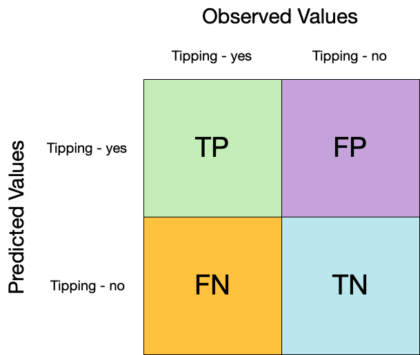
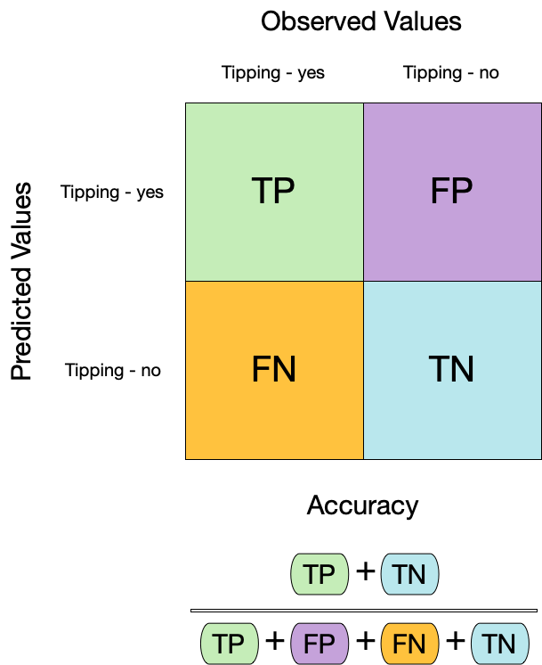
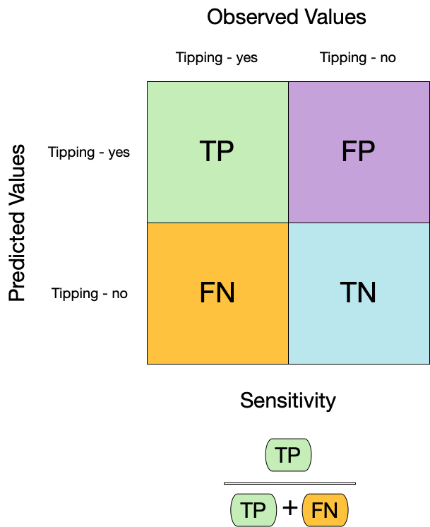
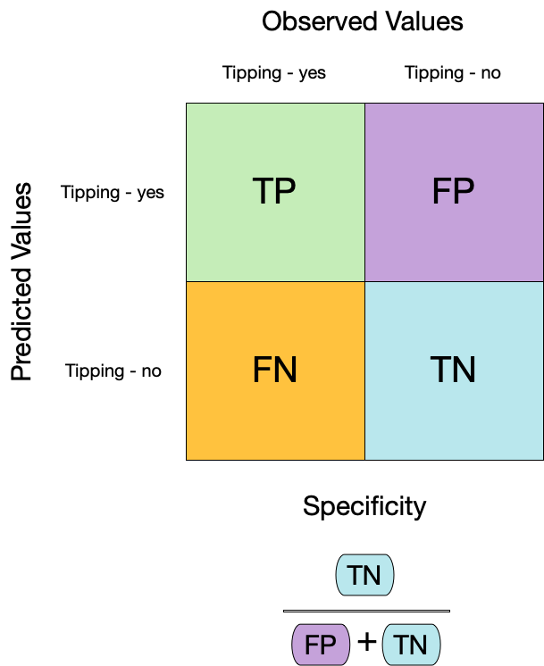

```{r setup}
#| include: false
#| file: setup.R
```

## Looking at predictions

```{r setup-previous}
#| echo: false
library(tidymodels)

set.seed(123)
cls_split <- initial_split(cls_data_2026, prop = 0.8)
cls_train <- training(cls_split)
cls_test <- testing(cls_split)

tree_spec <- decision_tree(cost_complexity = 0.0001, mode = "classification")
cls_wflow <- workflow(class ~ ., tree_spec)
cls_fit <- fit(cls_wflow, cls_train)
```

## Logistic Fit

```{r example-fit-augment}
lr_fit <- 
  logistic_reg() |> 
  fit(class ~ ., data = cls_train)

augment(lr_fit, new_data = cls_train) |> print(n = 5)

lr_re_pred <- augment(lr_fit, new_data = cls_train)
```

## Confusion matrix `r hexes("yardstick")`



## Confusion matrix `r hexes("yardstick")`

```{r conf-mat}
lr_re_pred |>
  conf_mat(truth = class, estimate = .pred_class)
```

## Confusion matrix `r hexes("yardstick")`

```{r conf-mat-plot}
lr_re_pred |>
  conf_mat(truth = class, estimate = .pred_class) |>
  autoplot(type = "heatmap")
```

## Metrics for model performance `r hexes("yardstick")`

::: columns
::: {.column width="60%"}
```{r acc}
lr_re_pred |>
  accuracy(truth = class, estimate = .pred_class)
```
:::

::: {.column width="40%"}

:::
:::

## Dangers of accuracy `r hexes("yardstick")`

We need to be careful of using `accuracy()` since it can give "good" performance by only predicting one way with imbalanced data:

```{r acc-2}
lr_re_pred %>%
  mutate(.pred_class = factor("class_1", levels = c("class_1", "class_2"))) %>%
  accuracy(truth = class, estimate = .pred_class)
```

## Brier score formula

What if we don't turn predicted probabilities into class predictions?

. . .

The Brier score is analogous to the mean squared error in regression models:

$$
Brier_{class} = \frac{1}{NC}\sum_{i=1}^N\sum_{k=1}^C (y_{ik} - \hat{p}_{ik})^2
$$

## Brier score  {.annotation}

```{r brier}
lr_re_pred |> 
  brier_class(truth = class, .pred_class_1) 
```

. . .

Smaller values are better, for binary classification the "bad model threshold" is about 0.25.


## Separation and calibration

::: columns
::: {.column width="50%"}
The ROC captures separation.
```{r separation-example}
#| echo: false
#| fig-height: 4
#| fig-width: 5
#| out-width: 100%
lr_re_pred |> 
  ggplot(aes(.pred_class_1)) + 
  geom_histogram(col = "white", binwidth = 0.04) + 
  facet_wrap(~ class, ncol = 1) + 
  lims(x = 0:1) +
  labs(x = "Predicted probability of Class 1") +
  lims(y = c(0, 100))
```
:::
::: {.column width="50%"}
The Brier score captures calibration.
```{r calibration-example}
#| echo: false
#| fig-height: 4
#| fig-width: 5
#| out-width: 100%
library(probably)

lr_re_pred |> 
  cal_plot_breaks(class, .pred_class_1)
```
:::
:::

::: notes
- Good separation: the densities don't overlap.
- Good calibration: the calibration line follows the diagonal.

Calibration plot: We bin observations according to predicted probability. In the bin for 20%-30% predicted prob, we should see an event rate of ~25% if the model is well-calibrated.
:::

## Separation and (bad) calibration
::: columns
::: {.column width="50%"}
Excellent separation
```{r bad-separation-example}
#| echo: false
#| fig-height: 4
#| fig-width: 5
#| out-width: 100%
set.seed(201)
bad_pred <- 
  lr_re_pred |> 
  mutate(
    bad = if_else(class == "class_1", rnorm(nrow(lr_re_pred), 0.58, 0.03), rnorm(nrow(lr_re_pred), 0.42, 0.03))
  )

bad_pred  |> 
  ggplot(aes(bad)) + 
  geom_histogram(col = "white", binwidth = 0.03) + 
  facet_wrap(~ class, ncol = 1) + 
  lims(x = 0:1) +
  labs(x = "Predicted probability of Class 1")
```
:::
::: {.column width="50%"}
Terrible calibration.
```{r bad-calibration-example}
#| echo: false
#| fig-height: 4
#| fig-width: 5
#| out-width: 100%

bad_pred |> 
  cal_plot_breaks(class, bad)
```
:::
:::


## Your turn {transition="slide-in"}

{.absolute top="0" right="0" width="150" height="150"}

The probably package was used to make the calibration plots: 

```r
library(probably)
lr_re_pred |> cal_plot_breaks(class, .pred_class_1)
```

<br> 

Try the other calibration curve methods in probably: 

 - [`cal_plot_logistic()`](https://probably.tidymodels.org/reference/cal_plot_logistic.html)
 - [`cal_plot_windowed()`](https://probably.tidymodels.org/reference/cal_plot_windowed.html)
 
Do you prefer one over the others? 


```{r ex-example-grouped-metrics}
#| echo: false
countdown::countdown(minutes = 5, id = "calibration-plots")
```

## Metrics for model performance `r hexes("yardstick")`

We can use `metric_set()` to combine multiple calculations into one

```{r example-metrics}
cls_metrics <- metric_set(accuracy, brier_class)

lr_re_pred |>
  cls_metrics(truth = class, estimate = .pred_class, .pred_class_1)
```

## Metrics for model performance `r hexes("yardstick")`

Metrics and metric sets work with grouped data frames!

```{r accuracy-grouped}
lr_re_pred |>
  mutate(group = rep_len(LETTERS[1:3], nrow(cls_train))) |> 
  group_by(group) |>
  cls_metrics(truth = class, estimate = .pred_class, .pred_class_1)
```


##  {background-iframe="https://yardstick.tidymodels.org/reference/index.html"}

::: footer
:::

# ⚠️ DANGERS OF OVERFITTING ⚠️

## Dangers of overfitting


```{r}
#| label: overfitting-training
#| echo: false
#| out-width: 90%
#| fig-width: 10
#| fig-height: 4
#| fig-align: "center"
#| warning: false

load("overfitting_data.RData")
p_tr <- 
  svm_res |> 
  select(cost, label, grid) |> 
  unnest(cols = c(grid)) %>%
  ggplot(aes(x = X1, y = X2)) +
  geom_point(
    data = training_set,
    aes(col = class),
    alpha = .75,
    cex = 1,
    show.legend = FALSE
  ) +
  geom_contour(aes(z = .pred_Class1), breaks = 0.5, col = "black") +
  facet_wrap( ~ label, nrow = 1) +
  ggtitle("Training Set (Parabolic Data)") +
  labs(x = "Predictor A", y = "Predictor B") + 
  lims(x = c(-5.2, 5.2), y = c(-5.2, 5.2)) +
  coord_fixed(ratio = 1) +
  scale_color_manual(values = c("#FFAD0AFF", "#1BB6AFFF"))

p_tr_stat <- 
  svm_res |> 
  select(cost, label, train_stats) |> 
  unnest(cols = c(train_stats)) |> 
  ggplot(aes(y = .row, x = .col, label = result)) + 
  geom_text() + facet_wrap(~ label) + 
  theme_void()+ lims(y = c(0, 3)) + 
  theme(strip.text = element_blank()) 

p_tr / p_tr_stat + plot_layout(heights = c(4, 1))
```

::: {.absolute bottom=0 right=0}
[AML4TD](https://aml4td.org/chapters/overfitting.html)
:::

## Dangers of overfitting ⚠️


```{r}
#| label: overfitting-testing
#| echo: false
#| out-width: 90%
#| fig-width: 10
#| fig-height: 4
#| fig-align: "center"

p_tr <- 
  svm_res |> 
  select(cost, label, grid) |> 
  unnest(cols = c(grid)) %>%
  ggplot(aes(x = X1, y = X2)) +
  geom_point(
    data = testing_set,
    aes(col = class),
    alpha = .75,
    cex = 1,
    show.legend = FALSE
  ) +
  geom_contour(aes(z = .pred_Class1), breaks = 0.5, col = "black") +
  facet_wrap( ~ label, nrow = 1) +
  ggtitle("Testing Set (Parabolic Data)") +
  labs(x = "Predictor A", y = "Predictor B") + 
  lims(x = c(-5.2, 5.2), y = c(-5.2, 5.2)) +
  coord_fixed(ratio = 1) +
  scale_color_manual(values = c("#FFAD0AFF", "#1BB6AFFF"))

p_tr_stat <- 
  svm_res |> 
  select(cost, label, test_stats) |> 
  unnest(cols = c(test_stats)) |> 
  ggplot(aes(y = .row, x = .col, label = result)) + 
  geom_text() + facet_wrap(~ label) + 
  theme_void()+ lims(y = c(0, 3)) + 
  theme(strip.text = element_blank()) 

p_tr / p_tr_stat + plot_layout(heights = c(4, 1))
```

## Dangers of overfitting 

- The underfit model's performance didn't change that much. It is too simple and can't overfit
- The overfit model is too complex:
  - It is chasing specific data points so that it can predict the training set points as perfectly as possible. 
  - It _over_ adapts to the training data because it can be very flexible. 
- We can't really know if it under- or overfits until we have new data.


## Dangers of overfitting ⚠️ `r hexes("yardstick")`

```{r augment-train}
lr_fit |>
  augment(cls_train) |> 
  print(n = 5)
```

<br>

We call this "resubstitution" or "repredicting the training set"

## Dangers of overfitting ⚠️ `r hexes("yardstick")`

```{r augment-acc}
lr_fit |>
  augment(cls_train) |>
  accuracy(class, .pred_class)
```

We call this a "resubstitution estimate"

## Dangers of overfitting ⚠️ `r hexes("yardstick")`

::: columns
::: {.column width="50%"}
```{r augment-acc-2}
lr_fit |>
  augment(cls_train) |>
  accuracy(class, .pred_class)
```
:::

::: {.column width="50%"}
:::
:::

## Dangers of overfitting ⚠️ `r hexes("yardstick")`

::: columns
::: {.column width="50%"}
```{r augment-acc-3}
lr_fit |>
  augment(cls_train) |>
  accuracy(class, .pred_class)
```
:::

::: {.column width="50%"}
```{r augment-acc-test}
lr_fit |>
  augment(cls_test) |>
  accuracy(class, .pred_class)
```
:::
:::

. . .

Why aren't the numbers very different? 

. . .

Can basic logistic regression overfit? 

. . .

⚠️ Remember that we're demonstrating overfitting 

. . .

⚠️ Don't use the test set until the *end* of your modeling analysis


##  {background-image="https://media.giphy.com/media/55itGuoAJiZEEen9gg/giphy.gif" background-size="70%"}

## Dangers of overfitting ⚠️ `r hexes("yardstick")`

::: columns
::: {.column width="50%"}
```{r brier-class}
lr_fit |>
  augment(cls_train) |>
  brier_class(class, .pred_class_1)
```
:::

::: {.column width="50%"}
```{r brier-class-2}
lr_fit |>
  augment(cls_test) |>
  brier_class(class, .pred_class_1)
```
:::
:::

. . .

What if we want to compare more models?

. . .

And/or more model configurations?

. . .

And we want to understand if these are important differences?

# The testing data are precious 💎

# How can we use the *training* data to compare and evaluate different models? 🤔

##  {background-color="white" background-image="https://www.tmwr.org/premade/resampling.svg" background-size="80%"}

## Cross-validation


## Cross-validation


## Your turn {transition="slide-in"}

{.absolute top="0" right="0" width="150" height="150"}

*If we use 10 folds, what percent of the training data*

-   *ends up in analysis*
-   *ends up in assessment*

```{r ex-percent-in-folds}
#| echo: false
countdown::countdown(minutes = 3, id = "percent-in-folds")
```

## Cross-validation `r hexes("rsample")`

```{r vfold-cv}
vfold_cv(cls_train) # v = 10 is default
```

## Cross-validation `r hexes("rsample")`

What is in this?

```{r example-splits}
cls_folds <- vfold_cv(cls_train)
cls_folds$splits[1:3]
```

::: notes
Talk about a list column, storing non-atomic types in dataframe
:::

## Cross-validation `r hexes("rsample")`

```{r vfold-cv-v}
vfold_cv(cls_train, v = 5)
```

## Cross-validation `r hexes("rsample")`

We'll use this setup:

```{r example-folds}
set.seed(343)
cls_folds <- vfold_cv(cls_train, v = 10)
cls_folds
```

. . .

Set the seed when creating resamples

# We are equipped with metrics and resamples!

## Fit our model to the resamples

```{r fit-resamples}
lr_wflow <- workflow(class ~ ., logistic_reg())

cls_res <- fit_resamples(lr_wflow, cls_folds)
cls_res
```

## Evaluating model performance `r hexes("tune")`

```{r collect-metrics}
cls_res |>
  collect_metrics()
```

::: notes
`collect_metrics()` is one of a suite of `collect_*()` functions that can be used to work with columns of tuning results. Most columns in a tuning result prefixed with `.` have a corresponding `collect_*()` function with options for common summaries.
:::

. . .

We can reliably measure performance using only the **training** data 🎉

## Comparing metrics `r hexes("yardstick")`

How do the metrics from resampling compare to the metrics from training and testing?

```{r calc-roc-auc}
#| echo: false
cls_training_brier <-
  lr_fit |>
  augment(cls_train) |>
  brier_class(class, .pred_class_1) |>
  pull(.estimate) |>
  round(digits = 3)

cls_testing_brier <-
  lr_fit |>
  augment(cls_test) |>
  brier_class(class, .pred_class_1) |>
  pull(.estimate) |>
  round(digits = 3)
```

::: columns
::: {.column width="50%"}
```{r collect-metrics-2}
cls_res |>
  collect_metrics() |> 
  select(.metric, mean, std_err, n)
```
:::

::: {.column width="50%"}
The Brier score previously was

- `r cls_training_brier` for the training set
- `r cls_testing_brier` for test set
:::
:::

. . .

Remember that:

⚠️ the training set gives you overly optimistic metrics

⚠️ the test set is precious

## Your turn {transition="slide-in"}

{.absolute top="0" right="0" width="150" height="150"}

Rerun the same code three times with different random number seeds. 

How much do the results change? 

```{r ex-try-refit-resamples}
#| echo: false
countdown::countdown(minutes = 8, id = "try-refit-resamples")
```


## Evaluating model performance `r hexes("tune")`

```{r save-predictions}
# Save the assessment set results
ctrl_rs <- control_resamples(save_pred = TRUE)
cls_res <- fit_resamples(lr_wflow, cls_folds, control = ctrl_rs)

cls_res
```

## Evaluating model performance `r hexes("tune")`

```{r collect-predictions}
# Save the assessment set results
cls_preds <- collect_predictions(cls_res)
cls_preds
```

## Evaluating model performance `r hexes("tune")`

```{r example-metrics-by-id}
cls_preds |> 
  group_by(id) |>
  cls_metrics(truth = class, estimate = .pred_class, .pred_class_1)
```

## Where are the fitted models? `r hexes("tune")`  {.annotation}

```{r example-res}
cls_res
```

. . .

🗑️

# Decision tree 🌳

# Random forest 🌳🌲🌴🌵🌴🌳🌳🌴🌲🌵🌴🌲🌳🌴🌳🌵🌵🌴🌲🌲🌳🌴🌳🌴🌲🌴🌵🌴🌲🌴🌵🌲🌵🌴🌲🌳🌴🌵🌳🌴🌳

## Random forest 🌳🌲🌴🌵🌳🌳🌴🌲🌵🌴🌳🌵

- Ensemble many decision tree models

- All the trees vote! 🗳️

- Bootstrap aggregating + random predictor sampling

. . .

- Often works well without tuning hyperparameters (more on this later!), as long as there are enough trees

## Create a random forest model `r hexes("parsnip")`

```{r rf-spec}
rf_spec <- rand_forest(trees = 1000, mode = "classification")
rf_spec
```

## Create a random forest model `r hexes("workflows")`

```{r rf-wflow}
rf_wflow <- workflow(class ~ ., rf_spec)
rf_wflow
```

## Your turn {transition="slide-in"}

{.absolute top="0" right="0" width="150" height="150"}

*Use `fit_resamples()` and `rf_wflow` to:*

-   *keep predictions*
-   *compute metrics*

```{r ex-try-fit-resamples}
#| echo: false
countdown::countdown(minutes = 8, id = "try-fit-resamples")
```

## Evaluating model performance `r hexes("tune")`

```{r collect-metrics-rf}
ctrl_rs <- control_resamples(save_pred = TRUE)

# Random forest uses random numbers so set the seed first

set.seed(2)
rf_res <- fit_resamples(rf_wflow, cls_folds, control = ctrl_rs)
collect_metrics(rf_res)
```

## Evaluating model performance `r hexes("tune")`

probably has a nice interface for calibration curves:

```{r}
#| label: fit-resamples-cal-plot
cal_plot_windowed(rf_res, step_size = 0.03)
```

<br>

The out-of-sample predictions are pooled before computing the calibration curve. 


## The final fit `r hexes("tune")` 

Suppose that we are happy with our random forest model.

Let's fit the model on the training set and verify our performance using the test set.

. . .

We've shown you `fit()` and `predict()` (+ `augment()`) but there is a shortcut:

```{r final-fit}
# cls_split has train + test info
final_fit <- last_fit(rf_wflow, cls_split) 

final_fit
```

## What is in `final_fit`? `r hexes("tune")`

```{r collect-metrics-final-fit}
collect_metrics(final_fit)
```

. . .

These are metrics computed with the **test** set

## What is in `final_fit`? `r hexes("tune")`

```{r collect-predictions-final-fit}
collect_predictions(final_fit)
```

## What is in `final_fit`? `r hexes("tune")`

```{r extract-workflow}
extract_workflow(final_fit)
```

. . .

Use this for **prediction** on new data, like for deploying


## Your turn {transition="slide-in"}

{.absolute top="0" right="0" width="150" height="150"}

Repredict the training set using `final_fit`. 

Does the random forest model give overly optimistic results on the training set? 

```{r ex-try-rf-overfit}
#| echo: false
countdown::countdown(minutes = 8, id = "try-rf-overfit")
```


## The whole game

```{r diagram-final-performance, echo = FALSE}
#| fig-align: "center"

knitr::include_graphics("images/whole-game-final-performance.jpg")
```

# Backup Slides {background-color="#BDE9C9FF"}


## Metrics for model performance `r hexes("yardstick")`

::: columns
::: {.column width="60%"}
```{r sens}
lr_re_pred |>
  sensitivity(truth = class, estimate = .pred_class)
```
:::

::: {.column width="40%"}

:::
:::


## Metrics for model performance `r hexes("yardstick")`

::: columns
::: {.column width="60%"}
```{r sens-2}
#| code-line-numbers: "3-6"
lr_re_pred |>
  sensitivity(truth = class, estimate = .pred_class)
```

<br>

```{r spec}
lr_re_pred |>
  specificity(truth = class, estimate = .pred_class)
```
:::

::: {.column width="40%"}

:::
:::


## Two class data

These metrics assume that we know the threshold for converting "soft" probability predictions into "hard" class predictions.

. . .

Is a 50% threshold good? 

What happens if we say that we need to be 80% sure to declare an event?

-   sensitivity ⬇️, specificity ⬆️

. . .

What happens for a 20% threshold?

-   sensitivity ⬆️, specificity ⬇️

## Varying the threshold

```{r}
#| label: thresholds
#| echo: false

lr_re_pred |> 
  roc_curve(truth = class, .pred_class_1) |> 
  filter(is.finite(.threshold)) |> 
  pivot_longer(c(specificity, sensitivity), names_to = "statistic", values_to = "value") |> 
  rename(`event threshold` = .threshold) |> 
  ggplot(aes(x = `event threshold`, y = value, col = statistic, group = statistic)) + 
  geom_line() +
  scale_color_brewer(palette = "Dark2") +
  labs(y = NULL) +
  coord_equal() +
  theme(legend.position = "top")
```

## ROC curves

::: columns
::: {.column width="50%"}
For an ROC (receiver operator characteristic) curve, we plot

- the false positive rate (1 - specificity) on the x-axis
- the true positive rate (sensitivity) on the y-axis

with sensitivity and specificity calculated at all possible thresholds.
:::

::: {.column width="50%"}
```{r roc-curve-1}
#| echo: false
#| fig-width: 4
#| fig-height: 4
#| out.width: 100%

p_roc <- lr_re_pred |> 
  roc_curve(truth = class, .pred_class_1) |>
  autoplot()
p_roc
```
:::
:::

:::notes
ROC curves are insensitive to class imbalance.
:::

## ROC curves

::: columns
::: {.column width="50%"}
We can use the area under the ROC curve as a classification metric: 

- ROC AUC = 1 💯 
- ROC AUC = 1/2 😢
:::

::: {.column width="50%"}
```{r roc-curve-2}
#| echo: false
#| fig-width: 4
#| fig-height: 4
#| out.width: 100%
p_roc
```
:::
:::

## ROC curves `r hexes("yardstick")`

```{r roc-auc}
# Assumes _first_ factor level is event; there are options to change that
lr_re_pred |> 
  roc_curve(truth = class, .pred_class_1) |>
  slice(1, 20, 50)

lr_re_pred |> 
  roc_auc(truth = class, .pred_class_1)
```

## ROC curve plot `r hexes("yardstick")`

```{r roc-curve-code}
#| fig-width: 4
#| fig-height: 4
#| out.width: 100%
#| output-location: "column"

augment(lr_fit, 
        new_data = cls_train) |> 
  roc_curve(truth = class, 
            .pred_class_1) |>
  autoplot()
```

## Your turn {transition="slide-in"}

{.absolute top="0" right="0" width="150" height="150"}

*Compute and plot an ROC curve for your current model.*

*What data are being used for this ROC curve plot?*

```{r ex-roc-curve}
#| echo: false
countdown::countdown(minutes = 5, id = "roc-curve")
```


# Alternate resampling schemes

## Bootstrapping


## Bootstrapping `r hexes("rsample")`

```{r bootstraps}
set.seed(3214)
bootstraps(cls_train)
```

##  {background-iframe="https://rsample.tidymodels.org/reference/index.html"}

::: footer
:::

## The whole game - status update

```{r diagram-resamples, echo = FALSE}
#| fig-align: "center"

knitr::include_graphics("images/whole-game-transparent-resamples.jpg")
```

## Your turn {transition="slide-in"}

{.absolute top="0" right="0" width="150" height="150"}

*Create:*

-   *Monte Carlo Cross-Validation sets*
-   *validation set*

(use the reference guide to find the functions)

*Don't forget to set a seed when you resample!*

```{r ex-try-rsample}
#| echo: false
countdown::countdown(minutes = 5, id = "try-rsample")
```

## Monte Carlo Cross-Validation `r hexes("rsample")`

```{r mc-cv}
set.seed(322)
mc_cv(cls_train, times = 10)
```

## Validation set `r hexes("rsample")`

```{r validation-split}
set.seed(853)
cls_val_split <- initial_validation_split(cls_data_2026)
validation_set(cls_val_split)
```

. . .

A validation set is just another type of resample
