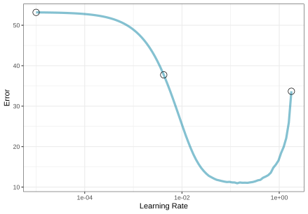
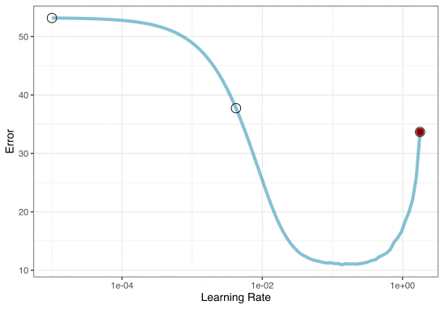
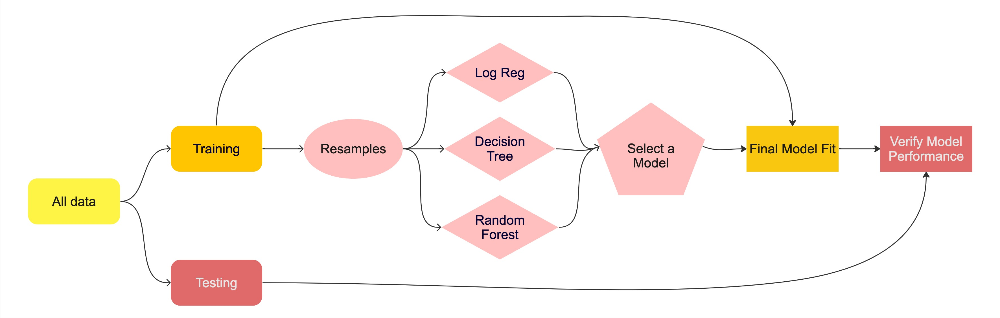

```{r}
#| label: setup
#| include: false
#| file: setup.R
```


## Previously....

```{r setup-previous}
#| echo: false
library(tidymodels)

set.seed(123)
cls_split <- initial_split(cls_data_2026, prop = 0.8)
cls_train <- training(cls_split)
cls_test <- testing(cls_split)

set.seed(123)
cls_folds <- vfold_cv(cls_train, v = 10)
```

## Tuning parameters

Some model or preprocessing parameters cannot be estimated directly from the data.

. . .

Some examples:

- Tree depth in decision trees
- Number of neighbors in a K-nearest neighbor model

## Optimize tuning parameters

- Try different values and measure their performance.

. . .

- Find good values for these parameters.

. . .

- Once the value(s) of the parameter(s) are determined, a model can be finalized by fitting the model to the entire training set.


## Optimize tuning parameters

The two main strategies for optimization are:

- **Grid search**, which tests a pre-defined set of candidate values.

- **Iterative search**, which suggests/estimates new values of candidate parameters to evaluate.

. . .

We won't be discussing iterative search methods in the regular notes. But you can learn more in [AML4TD](https://aml4td.org/chapters/iterative-search.html) or in the extra slides for this subject. 

<br> 

Let's talk about a specific model (boosting) to demonstrate. 

## Boosted Trees

These are popular ensemble methods that build a _sequence_ of tree models. 

<br>

Each tree uses the results of the previous tree to better predict samples, especially those that have been poorly predicted. 

<br>

Each tree in the ensemble is saved, and new samples are predicted using a weighted average of its votes. 

<br>

We'll focus on the popular xgboost implementation. 

## Boosted Tree Tuning Parameters

Some _possible_ parameters: 

* `trees`: The number of trees ($[1, \infty]$, but usually up to thousands).
* `min_n`: The number of samples needed to further split ($[1, n]$).
* `learn_rate`: The rate that each tree adapts from previous iterations ($(0, \infty]$, usual maximum is about 0.1).
* `stop_iter`: The number of iterations of boosting where _no improvement_ was shown before stopping ($[1, trees]$).

We'll focus on the learning rate for now. 

## Grid search

A small grid of points trying to minimize the error via learning rate: 


{fig-align="center" width=60%}


## Grid search

In reality, we would probably sample the space more densely: 

{fig-align="center" width=60%}


## Iterative Search

We could start with a few points and search the space:

{fig-align="center" width=60%}

## Working with Parameters

-   The tidymodels framework provides pre-defined information on tuning parameters (such as their type, range, transformations, etc.).

-   The `extract_parameter_set_dials()` function extracts these tuning parameters and the info.


```{r}
#| label: bst-param
#| message: true
bst_spec <- boost_tree(trees = 100, learn_rate = tune(), mode = "classification")
bst_wflow <- workflow(class ~ ., bst_spec)

bst_param <- 
  bst_wflow |> 
  extract_parameter_set_dials() 
bst_param  
```  

## Different types of grids `r hexes(c("dials"))`  {.annotation}


```{r} 
#| label: grid-types
#| echo: false
#| fig-width: 10
#| fig-height: 2.7
#| fig-align: 'center'
#| out-width: 100%

model__param <- parameters(min_n(), learn_rate())

reg_1 <- grid_regular(model__param, levels = c(4, 4)) |> 
  mutate(type = "Regular (balanced)")
reg_2 <- grid_regular(model__param, levels = c(3, 5)) |> 
  mutate(type = "Regular (unbalanced)")

irreg_1 <- grid_space_filling(model__param, size = 16, type = "uniform") |> 
  mutate(type = "SFD: Uniform")

set.seed(431)
irreg_2 <- grid_random(model__param, size = 16) |> 
  mutate(type = "Random")
irreg_3 <- grid_space_filling(model__param, size = 16, type = "latin_hypercube") |> 
  mutate(type = "SFD: Latin Hypercube")

lvls <- c("Regular (balanced)", "Regular (unbalanced)", "Random", 
          "SFD: Latin Hypercube", "SFD: Uniform")

grids <- 
  bind_rows(reg_1, reg_2, irreg_1, irreg_2, irreg_3) |> 
  mutate(type = factor(type, levels = lvls))

grids |> 
  ggplot(aes(min_n, learn_rate)) + 
  geom_point() + 
  scale_y_log10() +
  facet_wrap(~ type, nrow = 1) +
  labs(x = min_n()$label, y = learn_rate()$label)
```


[Space-filling designs](https://aml4td.org/chapters/grid-search.html#sec-irregular-grid) (SFD) attempt to cover the parameter space without redundant candidates. We recommend these the most, and they are the default. 

## Try out multiple values

`tune_grid()` works similar to `fit_resamples()` but covers multiple parameter values:

```{r}
#| label: rf-tune_grid
#| code-line-numbers: "2|3-4|5|"

set.seed(22)
bst_res <- tune_grid(
  bst_wflow,
  cls_folds,
  grid = 15
)
```

## Compare results

Inspecting results and selecting the best-performing hyperparameter(s):

```{r}
#| label: autoplot
#| fig-width: 7
#| fig-height: 4
#| out-width: 70%
#| fig-align: center

autoplot(bst_res)
```


## Saving predictions

Let's repeat this process but make sure that we keep the out-of-sample predictions

```{r}
#| label: rf-tune-grid-pred
#| code-line-numbers: "2|3-4|5|"

set.seed(22)
bst_res <- tune_grid(
  bst_wflow,
  cls_folds,
  grid = 15,
  control = control_grid(save_pred = TRUE)
)
```


## Checking (Approximate) Calibration `r hexes(c("tune", "probably"))`

```{r}
#| label: nnet-cal-plot
#| output-location: column
#| out-width: 90%
#| fig-width: 5
#| fig-height: 5
#| eval: false

bst_res |>
  cal_plot_windowed(
    # truth = class,
    # estimate = .pred_event,
    window_size = 0.2,
    step_size = 0.025,
  )
```


## Compare results

Which is numerically best? 

```{r}
#| label: rf-results

show_best(bst_res)

best_parameter <- select_best(bst_res)
best_parameter
```

`collect_metrics()` and `autoplot()` are also available.

## Compare results

autoplot

save predictions

fit_best

extracts

## Running in parallel  {.annotation}

-   Grid search, combined with resampling, requires fitting a lot of models!

-   These models don't depend on one another and can be run in parallel.

We can use the future or mirai packages to do this:

```{r}
cores <- parallelly::availableCores(logical = FALSE)
```

<br>

::: columns
::: {.column width="50%"}

```{r}
#| eval: false
#| label: parallel-future

library(future)
plan(multisession, workers = cores)

# Now call `tune_grid()`!
```
:::

::: {.column width="50%"}
```{r}
#| eval: false
#| label: mirai-methods
library(mirai)
daemons(cores)

# Now call `tune_grid()`!
```
:::
:::

We'll use mirai as our parallel backend for our notes. 

## Distributing tasks 

When only tuning the model:


```{r}
#| label: resample-times
#| echo: false
#| out-width: '40%'
#| fig-width: 6
#| fig-height: 6
#| fig-align: 'center'
#| dev-args:
#|   bg: "transparent"
load("resamples_times.RData")
resamples_times |>
  dplyr::rename(operation = label) |> 
  ggplot(aes(y = id_alt, x = duration, fill = operation)) +
  geom_bar(stat = "identity", color = "black") +
  labs(y = NULL, x = "Elapsed Time") + 
  scale_fill_brewer(palette = "Paired") +
  theme(legend.position = "top")
```

## Running in parallel

Speed-ups are fairly linear up to the number of physical cores (10 here).

```{r}
#| label: parallel-speedup
#| echo: false
#| out-width: '80%'
#| fig-width: 8
#| fig-height: 3.25
#| fig-align: 'center'
#| dev-args:
#|   bg: "transparent"
load("xgb_times.RData")
ggplot(times, aes(x = num_cores, y = speed_up, color = parallel_over, shape = parallel_over)) + 
  geom_abline(lty = 1) + 
  geom_point(size = 2) + 
  geom_line() +
  facet_wrap(~ preprocessing) + 
  coord_obs_pred() + 
  scale_color_manual(values = c("#7FC97F", "#386CB0")) +
  labs(x = "Number of Workers", y = "Speed-up")  +
  theme(legend.position = "top")
```

:::notes
Faceted on the expensiveness of preprocessing used.
:::

## Your turn {transition="slide-in"}

{.absolute top="0" right="0" width="150" height="150"}

*Modify your model workflow to tune one or more parameters.*

*Use grid search to find the best parameter(s).*

```{r ex-tune-grid}
#| echo: false
countdown::countdown(minutes = 5, id = "tune-grid")
```


## The whole game - status update

```{r diagram-select, echo = FALSE}
#| fig-align: "center"

knitr::include_graphics("images/whole-game-transparent-select.jpg")
```

## The final fit `r hexes("tune")` 

Suppose that we are happy with our random forest model.

Let's fit the model on the training set and verify our performance using the test set.

. . .

We've shown you `fit()` and `predict()` (+ `augment()`) but there is a shortcut:

```{r final-fit}
bst_final_wflow <- finalize_workflow(bst_wflow, best_parameter)
# cls_split has train + test info
set.seed(690)
final_fit <- last_fit(bst_final_wflow, cls_split) 

final_fit
```

## What is in `final_fit`? `r hexes("tune")`

```{r collect-metrics-final-fit}
collect_metrics(final_fit)
```

. . .

These are metrics computed with the **test** set

## What is in `final_fit`? `r hexes("tune")`

```{r collect-predictions-final-fit}
collect_predictions(final_fit)
```

## What is in `final_fit`? `r hexes("tune")`

```{r extract-workflow}
extract_workflow(final_fit)
```

. . .

Use this for **prediction** on new data, like for deploying


## Class Boundary

```{r}
#| label: bst-boundary
#| echo: false
#| out-width: 100%
#| fig-width: 8
#| fig-height: 4
#| fig-align: "center"

rng_1 <- extendrange(cls_train$pred_1)
rng_2 <- extendrange(cls_train$pred_2)
seq_n <- 250
cls_grid <- 
  crossing(
    pred_1 = seq(rng_1[1], rng_1[2], length.out =seq_n),
    pred_2 = seq(rng_2[1], rng_2[2], length.out =seq_n)
  )

bst_grid <- augment(final_fit |> extract_workflow(), new_data = cls_grid)

bind_rows(
  cls_train |> mutate(Data = "Training"), 
  cls_test |> mutate(Data = "Testing")
) |> 
  mutate(Data = factor(Data, levels = c("Training", "Testing"))) |> 
  ggplot(aes(pred_1, pred_2)) + 
  geom_point(aes(col = class, pch = class), alpha = 2 / 3, cex = 2) + 
  coord_obs_pred() + 
  facet_wrap(~Data) + 
  theme(legend.position = "bottom") +
  geom_contour(
    data = bst_grid,
    aes(z = .pred_class_1),
    breaks = 1 / 2,
    col = "black",
    linewidth = 1 / 2
  ) +
  labs(col = NULL, pch = NULL)

```


## The whole game

```{r diagram-final-performance, echo = FALSE}
#| fig-align: "center"


```
